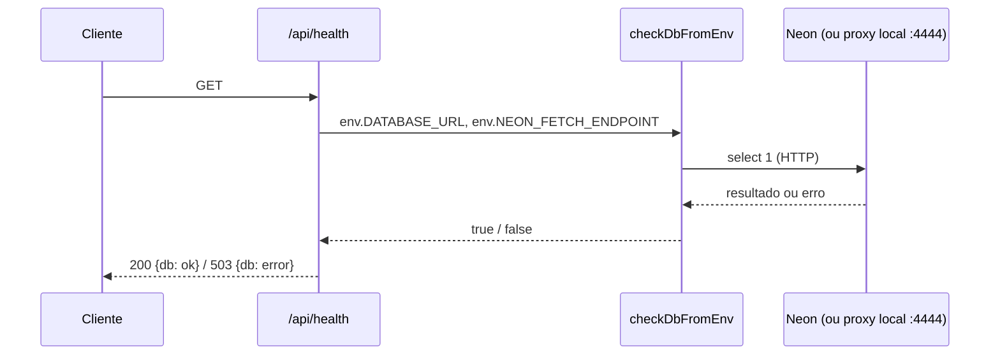
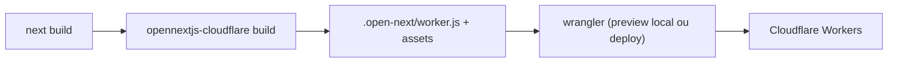

# Arquitetura

> Estado: **Fase 0 concluída + features 001 (autenticação), 002 (categorias)
> e 003 (produtos) implementadas; feature 004 (fotos) em andamento, só a base
> de servidor (`src/lib/r2/`) existe**. Este documento descreve apenas o que existe hoje
> no repositório. Para o que está planejado (catálogo, sacola, R2, IA), ver `.specify/memory/constitution.md` e
> os ADRs em `specs/adr/`.

## Visão leiga

O Roseshop ainda é, em grande parte, o esqueleto gerado pelo template oficial do
OpenNext para Cloudflare (`create-next-app` + `@opennextjs/cloudflare`). A raiz
do site continua sendo a página inicial padrão do Next.js; nenhuma tela de
catálogo ou sacola foi construída. As funcionalidades de produto são o
**login das administradoras** em `/painel` (ver
[F01-autenticacao.md](./features/F01-autenticacao.md)) e o **cadastro de
categorias** (ver [F02-categorias.md](./features/F02-categorias.md)) e o
**cadastro de produtos** (ver [F03-produtos.md](./features/F03-produtos.md))
no painel, sem fotos ainda. Uso real do banco: [database.md](./database.md).

O que já está de pé é a **esteira de build e deploy**: como o projeto, escrito
em Next.js, vira um Worker rodando na Cloudflare.

## Aprofundamento técnico

### Stack e versões (confirmado em `package.json`)

| Peça | Versão/pacote |
|---|---|
| Next.js | `16.3.8` (App Router, Turbopack) |
| React | `^19.1.7` |
| TypeScript | `^5.7.4` (modo `strict`, `target: es2024`) |
| Adaptador Cloudflare | `@opennextjs/cloudflare` `^1.20.3` |
| Wrangler (CLI Cloudflare) | `^4.147.0` |
| Tailwind CSS | `^4` (via `@tailwindcss/postcss`) |
| Lint | ESLint `^9`, flat config (`eslint-config-next`) |
| Testes | Vitest `^5.0.3` + Testing Library + jsdom (ver [operacao.md, "Testes"](./operacao.md#testes-vitest)) |

Banco: `drizzle-orm` `^0.45.3` e `@neondatabase/serverless` `^1.2.0` (runtime);
`drizzle-kit` `^0.31.11` e `pg` `^8.23.1` (dev, só migrations).

Autenticação (feature 001), dependências de runtime:

| Pacote | Versão | Observação |
|---|---|---|
| `next-auth` | `5.0.0-beta.32` (**exata**) | Auth.js v5, ainda beta (a tag `latest` do npm é a 4.x, descartada). Atualizar só em PR próprio, lendo o changelog e rodando `npm audit --omit=dev` (ADR-003, adendo; ADR-007). |
| `server-only` | `0.0.1` (**exata**) | Faz o build falhar se um módulo de servidor for importado no cliente. |
| `zod` | `^4.6.5` | Validação de e-mail da allowlist e de entradas da action de login. |

Fotos de produto (feature 004, em andamento), dependências de runtime e de build:

| Pacote | Versão | Observação |
|---|---|---|
| `aws4fetch` | `1.0.20` (**exata**) | Assinatura SigV4 (`AwsV4Signer`) da URL pré-assinada de envio ao R2. Sem dependências próprias (ADR-009 D1). |
| `wrangler` (dev) | `4.147.0` (**exata**, sem `^`) | O endpoint S3 local do R2 é experimental e depende da versão; ver [operacao.md, "wrangler fixado"](./operacao.md#wrangler-fixado-em-41470-devdependency). |

Não há ainda no `package.json`: SDK da OpenAI (a feature 004 prevê `fetch` direto). A IA
entra nas dependências quando for implementada (ver `specs/`).

### Estrutura de código atual

```
src/app/
  layout.tsx    # layout raiz (fonts Geist via next/font/google, <html lang="en">)
  page.tsx      # página inicial — ainda é o boilerplate do create-next-app
  globals.css   # estilos globais (Tailwind)
  api/health/route.ts   # GET /api/health (ver "Camada de banco")
  api/auth/[...nextauth]/route.ts   # handlers do Auth.js (GET, POST)
  painel/entrar/page.tsx            # tela de entrada (pública)
  painel/(protegido)/               # layout (moldura + "Sair"), page (saudação + links Produtos e Categorias), bfcache-reload
  painel/(protegido)/categorias/    # lista, nova/, [id]/renomear/, [id]/remover/ (F02)
  painel/(protegido)/produtos/      # lista, novo/, [id]/ (detalhe), [id]/editar/, [id]/remover/ (F03)
src/components/ui/   # componentes base: button, campo-texto, area-texto, selecao, caixa-marcacao, mensagem-campo, aviso
src/lib/auth/   # Auth.js + allowlist + guards (ver "Autenticação e proteção do painel")
src/lib/categorias/   # módulo de domínio de categorias (barrel somente leitura, painel, actions)
src/lib/produtos/     # módulo de domínio de produtos (actions, painel, validacao, preco, codigo, erros, mensagens)
src/lib/r2/   # R2: config, chaves, assinatura, bucket e verificação do arquivo (ver "Módulo R2")
infra/r2/     # CORS dos buckets, versionado (cors.dev.json, cors.production.json)
src/lib/db/
  client.ts     # createDb: Drizzle + driver HTTP do Neon
  health.ts     # checkDb: select 1
  schema.ts     # schema Drizzle (categorias, produtos, produto_fotos, fotos_envio, ia_uso)
  categorias.ts, produtos.ts # camadas SQL; contexto.ts, locks.ts, erros-pg.ts
  migrations/   # 0000 (função categoria_chave + categorias + seed), 0001 (produtos, produto_fotos), 0002 (fotos_envio, ia_uso, colunas de fotos) e meta/
  *.test.ts / *.int.test.ts   # testes unitário e de integração
src/test/       # conformance/ (testes de guard e de acesso) e db/ (fixtures de integração, medição de desempenho)
drizzle.config.ts   # config do drizzle-kit (migrations em src/lib/db/migrations)
vitest.config.mts, vitest.int.config.mts, vitest.probe.config.mts, vitest.perf.config.mts   # unitário, integração, probe do CI, medição local
```

Rotas: raiz, `/api/health`, `/painel/entrar`, `/painel`, `/api/auth/*` e as
quatro de `/painel/categorias` (lista, `nova`, `[id]/renomear`, `[id]/remover`)
e as cinco de `/painel/produtos` (lista, `novo`, `[id]`, `[id]/editar`, `[id]/remover`).
**Nenhum middleware** (de propósito; ver a seção seguinte).

### Autenticação e proteção do painel

**Visão leiga**: só as administradoras entram em `/painel`, com a conta Google,
e só se o e-mail estiver na lista `ADMIN_EMAILS`. Como o projeto não usa
middleware, cada página e cada ação confere sozinha quem está pedindo, e um teste
automático garante que ninguém esqueça essa conferência.

**Aprofundamento técnico** (zona protegida: `src/lib/auth/`):

- Auth.js v5 com Google, sessão **JWT em cookie, sem adapter e sem tabelas**.
  Configuração criada **por request** (`NextAuth(() => createAuthConfig())`),
  porque os secrets do Worker só existem em `process.env` durante o request.
- **Sem `middleware.ts`/`proxy.ts`**: o `proxy.ts` do Next 16 roda só em Node e
  o OpenNext o trata como experimental (ADR-003, adendo). Em vez disso:
  `getAdminSession` no layout (nunca redireciona), `requireAdminPage` em cada
  página, `requireAdminAction` em cada action e route handler. O teste
  `src/test/conformance/painel-guard.test.ts` nega por padrão e mantém a lista
  de exceções públicas por função.
- `trustHost: true`, sem `AUTH_URL` fixo (host da requisição; justificativa no
  adendo do ADR-003). Respostas de `/painel/:path*` saem com
  `Cache-Control: private, no-store` (`next.config.ts`).
- A allowlist é conferida no callback de login **e** a cada acesso
  (`getAdminSession`), então remover um e-mail bloqueia no próximo request.

Rotas, módulos, fluxo e pegadinhas em
[features/F01-autenticacao.md](./features/F01-autenticacao.md). Variáveis e
procedimento de emergência em [operacao.md](./operacao.md#administradoras-e-emergência-de-acesso).

### Camada de banco e health check

**Visão leiga**: o app já sabe "conversar" com o banco, mas ainda não guarda
nada. A única prova disso é o endereço `/api/health`, que responde se o banco
está de pé (útil para monitoramento e para checar o ambiente).

**Aprofundamento técnico** (zona protegida: `src/lib/db/`):

| Rota / função | Arquivo | O que faz |
|---|---|---|
| `GET /api/health` | `src/app/api/health/route.ts` | Lê `env` via `getCloudflareContext({ async: true })` e chama `checkDbFromEnv`. Responde `{db: "ok"}` com 200 ou `{db: "error"}` com 503, sempre com `Cache-Control: no-store`; `dynamic = "force-dynamic"`. |
| `createDb(env)` | `src/lib/db/client.ts` | Exige `DATABASE_URL` (lança erro se vazia). Se `NEON_FETCH_ENDPOINT` existir, seta `neonConfig.fetchEndpoint` (proxy local); senão usa o endpoint padrão do Neon. Retorna `drizzle({ client: neon(url), schema })` (`drizzle-orm/neon-http`). |
| `checkDbFromEnv(env)` | `src/lib/db/health.ts` | Chama `createDb` dentro de try/catch: configuração ausente ou inválida registra `[health] configuração do banco ausente ou inválida` e devolve `false` (503), **sem lançar**. Senão delega a `checkDb`. |
| `checkDb(db)` | `src/lib/db/health.ts` | Executa `select 1`; em falha registra só o `error.name` (a mensagem do driver pode conter host/usuário) e devolve `false`. |



Migrations: `drizzle-kit` (`drizzle.config.ts`) usa o driver `pg` por **TCP
direto** (não o proxy HTTP), conforme ADR-002, e escreve em
`src/lib/db/migrations/` (hoje só a `0000`, da feature 002; schema e tabelas em
[database.md](./database.md)). Validado no workerd: `npm run preview` ->
`/api/health` 200 `{db: ok}`.

**Sem transação interativa (ADR-008)**: o driver `neon-http` não suporta
`db.transaction()`. O que precisa de atomicidade usa `db.batch([...])` (uma
transação `READ COMMITTED`) com lock advisory (`pg_advisory_xact_lock`), cujas
chaves ficam em `src/lib/db/locks.ts`; invariantes que o banco consegue
expressar vão para constraints, colunas geradas e FKs. Nenhum código pode
assumir `db.transaction()`. Exemplo real: a remoção de categorias
([F02](./features/F02-categorias.md#fluxo-de-remoção-o-ponto-mais-delicado)).

**Acesso por contexto**: `src/lib/db/contexto.ts` (`dbDoContexto`) é a porta
que obtém o `db` a partir das bindings do Worker (`getCloudflareContext`)
para os módulos de categorias e produtos; `/api/health` continua montando o `db` por conta
própria.

**Connection string única (decisão N1 da feature 002)**: app (Worker dev), migration
e probe de CI usam o **mesmo** `DATABASE_URL` direto do Neon dev, sem pooler. O
`DATABASE_URL` do app vive como secret na Cloudflare; o do CI, como secret do
GitHub Environment `dev`; ambos com o mesmo valor (ver
[operacao.md, "CI"](./operacao.md#ci)). Se o app passar a usar a string com pooler,
o probe do `db.batch` precisa ser repetido antes de chegar à produção (ADR-008).

Pegadinhas e dívidas:

- `cloudflare-env.d.ts` (gerado pelo `cf-typegen` a partir do `.dev.vars`
  local) tipa `NEON_FETCH_ENDPOINT` como `string` obrigatória, mas ela não
  existe em dev online e produção; `DbEnv` a trata como opcional. Cuidado ao
  confiar no tipo gerado.
- `createDb` muda `neonConfig` global (estado de módulo) a cada chamada
  quando `NEON_FETCH_ENDPOINT` está definida.

### Build e deploy (OpenNext + Wrangler)

O fluxo de build é o padrão do adaptador `@opennextjs/cloudflare`:



- `next.config.ts` chama `initOpenNextCloudflareForDev()` — isso é o que permite
  usar `getCloudflareContext()` (acesso a bindings) rodando `next dev`, mesmo
  esse não sendo o runtime real de produção.
- `open-next.config.ts` usa `defineCloudflareConfig()` sem overrides. Há um
  comentário indicando que o cache incremental via R2
  (`r2-incremental-cache`) está disponível mas **desativado** — ninguém
  habilitou ainda.
- `wrangler.jsonc` tem **três ambientes** (detalhes e comandos em
  [operacao.md, "Deploy"](./operacao.md#deploy)): o nível de cima é o **local**
  (worker `roseshop-local`), `env.dev` é `roseshop-dev` e `env.production` é
  `roseshop`. Bindings são redeclarados por env, com o mesmo nome; `ASSETS` é
  herdado. O nível de cima declara:
  - `assets` — binding `ASSETS`, servindo `.open-next/assets` (estáticos).
  - `images` — binding `IMAGES`, para otimização de imagem do Next via Cloudflare
    Images (habilitado, mas nada no app ainda usa `next/image` além do boilerplate).
  - `services` — binding `WORKER_SELF_REFERENCE`, auto-referência do worker a
    si mesmo (`roseshop-local` no nível de cima; cada env aponta para o seu), usada pelo OpenNext para caching (ver
    [docs do OpenNext](https://opennext.js.org/cloudflare/caching)).
  - `observability.enabled: true` e `upload_source_maps: true`.
  - `r2_buckets` — binding `PRODUCT_IMAGES` (local `roseshop-local`, simulado;
    dev `roseshop-dev`; produção `roseshop-prod`). Usado por
    `src/lib/r2/bucket.ts` (ainda sem rota ou action que o chame). O item local
    traz `local_dev.experimental_s3_credentials` com credenciais **falsas e fixas**
    (não são segredo), que ligam o endpoint S3 do `preview`.
  - `vars.R2_S3_ENDPOINT` — endpoint S3 do bucket do ambiente (local
    `http://localhost:8787/cdn-cgi/local/r2/s3/roseshop-local`; dev e produção
    `https://<id da conta>.r2.cloudflarestorage.com/<bucket>`). `vars` não são
    herdadas: cada env redeclara.
  - `compatibility_date: "2026-10-01"` e flag `global_fetch_strictly_public`.
- `public/_headers` aplica cache imutável de 1 ano para `/_next/static/*`
  (arquivo lido pelo asset handler do Workers, não pelo Next).

Não há binding de banco (Neon/Hyperdrive) nem segredo de IA em `wrangler.jsonc`
(o banco é acessado por `DATABASE_URL`, secret/var, via HTTP); eles entram junto
com as features que os usam (conforme `specs/`).

### Ambientes decididos nos ADRs 002 e 006 (implementados)

A constitution (princípio VIII) e o ADR-006 (revisado) definem **três camadas
isoladas**. Hoje existem no repositório o `preview`, os três ambientes no
`wrangler.jsonc` (workers dev e produção publicados) e a stack Docker local de banco (`docker-compose.yml`, detalhada em
[operacao.md, "Banco local"](./operacao.md#banco-local-docker)). A stack
(Postgres 18 + proxy HTTP do Neon, scripts `npm run db:*`) já é consumida pelo app:
o Drizzle está configurado (`src/lib/db/`, `drizzle.config.ts`) e a conexão é
validada por `/api/health` (`src/app/api/health/route.ts`) e pelo teste de
integração `src/lib/db/client.int.test.ts` (`npm run test:int`, exige `db:up`).
O schema tem `categorias` (migration `0000`), `produtos` e `produto_fotos`
(`0001`), `fotos_envio` e `ia_uso` (`0002`, feature 004 em andamento, ainda sem
código que as use; ver [database.md](./database.md)).

| Recurso | Local | Dev online | Produção |
|---|---|---|---|
| Runtime | `npm run preview` (workerd) | Worker `roseshop-dev` | Worker `roseshop` |
| Banco | Postgres em Docker (ADR-002) | Neon, branch `dev` | Neon, branch `production` |
| Imagens | R2 simulado pelo wrangler (`.wrangler/state/`) | R2 `roseshop-dev` | R2 `roseshop-prod` |
| OpenAI | chave dev, limite baixo | chave dev, limite baixo | chave prod |
| Segredos | `.dev.vars` | `wrangler secret --env dev` | `wrangler secret --env production` |
| Login | Google, callback `localhost` | Google, callback dev | Google, callback produção |

Pontos-chave:

- **Banco (ADR-002)**: Postgres em todas as camadas, com um único driver,
  `@neondatabase/serverless` (HTTP). No local, o Postgres do Docker é exposto
  por um proxy HTTP compatível com o protocolo do Neon no mesmo
  `docker-compose` (implementado: Postgres 18 + proxy em `127.0.0.1:4444`); o
  endpoint vem de variável de ambiente (`NEON_FETCH_ENDPOINT`, só no local),
  sem ramificação no código. Migrations (Drizzle + `drizzle-kit`) são SQL versionado, aplicado
  local → dev → produção, usando conexão direta (não o proxy).
- **Entrega (ADR-006)**: PR → CI (lint, typecheck, testes, integração com
  `db:migrate` no Postgres do job) → migration no Neon `dev` → probe do
  `db.batch` e da FK de produtos no Neon `dev` → deploy em `roseshop-dev`; merge em `main` (humano) → migration no
  Neon `production` → deploy em `roseshop`. Segredos de deploy em GitHub
  Environments; segredos de runtime só na Cloudflare. Implementado em
  `.github/workflows/` (ver [operacao.md, "CI"](./operacao.md#ci)).
- **Regras**: a máquina local nunca acessa dev online nem produção; bindings
  do wrangler são declarados por environment (não herdados) e
  `WORKER_SELF_REFERENCE` aponta para o worker do próprio ambiente; mudança
  destrutiva de schema segue expand/contract.
- **Cota compartilhada**: os limites do free tier da Cloudflare são da conta,
  então dev e produção disputam a mesma cota; teste de carga roda só na stack
  Docker local.

### Alinhamento com ADR-006

Os blocos `env` do `wrangler.jsonc` (`dev` e `production`) existem (commit
`fffa3fe`), o `docker-compose.yml` é consistente com o ADR-002 e o CI
(`.github/workflows/`) implementa o fluxo do ADR-006 em `main`. O worker
`roseshop` (produção) está no ar desde o primeiro deploy pelo CI (merge do PR
#9, relato do mantenedor; `/api/health` = 200). O branch `main` é protegido
(informação do mantenedor, ver [operacao.md](./operacao.md#ci)).
`scripts/require-ci.mjs` bloqueia o deploy manual de produção. Detalhes em
[operacao.md, "CI"](./operacao.md#ci).

**Risco resolvido**: a flag `global_fetch_strictly_public` em
`wrangler.jsonc` **não** bloqueia o `fetch` do worker ao proxy local
(`localhost:4444`), validado no `preview` (ver
[operacao.md, "Banco local"](./operacao.md#banco-local-docker)).

### Processo de especificação (Spec Kit)

O repositório adotou o Spec Kit (v1.0.6, integração `claude`):

| Caminho | Papel |
|---|---|
| `.specify/memory/constitution.md` | Constitution v1.0.0 (princípios I a VIII); fonte das regras não negociáveis. Substitui o antigo `specs/00-constitution.md`, que não existe mais. |
| `.specify/templates/` | Templates de spec, plan, tasks, checklist e constitution. |
| `.specify/scripts/bash/` | Scripts usados pelas skills (criar feature, pré-requisitos, setup de plan/tasks). |
| `.specify/workflows/`, `.specify/*.json` | Workflow e estado/manifestos da integração. |
| `.claude/skills/speckit-*` | Skills `/speckit-specify`, `clarify`, `plan`, `tasks`, `analyze`, `implement`, `converge`, `checklist`, `constitution`, `taskstoissues`. |
| `specs/NNN-nome/` | Uma pasta por feature (`spec.md`, `plan.md`, `tasks.md`, entre outros). Hoje existem `001-auth-admins/` e `002-categorias/`. |
| `specs/adr/` | ADRs: `001`, `002`, `003`, `004`, `006`, `007` e `008` (integridade de dados com neon-http; ver a pasta). |

O `plan.md` de cada feature passa pelo Constitution Check. A ordem de uso está
no `CLAUDE.md`, seção "Spec Kit". Mapeamento da numeração antiga da
constitution para a nova: seção 4 = III (Segurança), 5 = IV, 6 = V, 7 = VI,
8 = VII (Ambiente e plataforma), 9 = VIII (Ambientes).

### Dívidas técnicas

- **Sem formatador de código** (decisão do humano, 2026-10-03): o repositório
  mistura tabs (`src/app/layout.tsx`, `src/app/page.tsx`,
  `src/components/ui/button.tsx`, `src/app/painel/(protegido)/page.tsx`,
  `next.config.ts`) e 2 espaços (`src/lib/`, demais arquivos do painel), sem
  formatador configurado. Adotar um em PR próprio, depois da feature 001.
- **Definições dos agentes** (`.claude/agents/`) a ajustar (decisão do humano,
  2026-10-04, após violações de processo na feature 001): nenhum agente executa
  pacote via `npx` que não seja dependência do projeto; nenhum agente executa
  comando fora do briefing; as verificações do `junior` nunca são finais (o
  tech-lead as reexecuta antes de reportar ao humano). Ver
  `specs/001-auth-admins/tasks.md`, "Dívidas registradas".
- **Cobertura do guard depende do teste de conformidade**: sem filtro central,
  um novo padrão de arquivo que o teste não conheça fica desprotegido sem
  alerta; estenda o teste ao introduzi-lo (ADR-003, adendo).
- **Comentário defasado em `.github/workflows/pull-request.yml`** (linha ~50):
  ainda diz que o probe roda "só `batch-transacao.int.test.ts`, sem tabelas", mas
  `vitest.probe.config.mts` agora inclui também `fk-produtos.int.test.ts`
  (escreve e apaga linhas marcadas). Config fora do escopo do doc-sync; ajustar
  em PR próprio.
- **`fotos` sempre vazio** em `DetalheProduto` (`src/lib/produtos/painel.ts`) até a
  feature 004 (fotos/R2); `produto_fotos` não é gravada por nenhum código.
- **`next-auth` em beta** (`5.0.0-beta.32`, versão exata): atualização manual e
  deliberada.
- **`<html lang="en">` em `src/app/layout.tsx`**: o produto é pt-BR, mas o
  layout raiz declara `lang="en"` (herança do `create-next-app`). Afeta
  leitores de tela e SEO. Também permanecem `title`/`description` genéricos
  ("Create Next App") em `metadata`. Corrigir ao implementar a primeira tela.

### Módulo R2 (feature 004, SF2 e SF3)

> Estado: só a base de servidor. **Não existem** rotas, Server Actions, UI de fotos,
> IA nem cron; nada fora de `src/lib/r2/` e dos testes chama o módulo ainda.

**Visão leiga**: a foto do produto não passa pelo servidor do site. A administradora
pede uma "autorização de envio" (uma URL temporária, válida por 5 minutos), o aparelho
manda o arquivo direto ao armazenamento (R2) e o servidor depois confere o que chegou.
Esta base entrega as peças: conferir o arquivo, gerar a autorização e ler/apagar objetos.

**Aprofundamento técnico** (zona protegida: `src/lib/r2/`; contrato em
`specs/004-fotos-produto/contracts/fotos.md`, decisões no ADR-009):

| Arquivo | Papel |
|---|---|
| `src/lib/r2/index.ts` | Barrel `server-only`: única porta de entrada para actions e rotas; reexporta `verificacao/`. |
| `src/lib/r2/verificacao/` | SF2. Verificação por lista de permitidos de JPEG e WebP (`verificarImagem`): lê o arquivo inteiro sem decodificar, lado entre `LADO_MINIMO` (400) e `LADO_MAXIMO` (1200), recusa animação e metadados fora da lista. Modo `registro` relaxa só o metadado (`modo.ts`). |
| `src/lib/r2/config.ts` | `configR2()`: valida com Zod `R2_S3_ENDPOINT` (https, exceto `localhost`/`127.0.0.1`; sem `/` final), `R2_ACCESS_KEY_ID` e `R2_SECRET_ACCESS_KEY` lidos de `process.env` a cada uso. O erro cita só os nomes. |
| `src/lib/r2/chaves.ts` | Chave do objeto `fotos/<uuid v4>.<webp\|jpg>`; `ARQUIVO_VALIDO` é a mesma regex da rota de exibição e do CHECK de `produto_fotos`. |
| `src/lib/r2/assinatura.ts` | `assinarEnvio({ chave, formato, tamanho })`: URL pré-assinada de PUT (SigV4, `AwsV4Signer`), expira em 300 s, com `content-length`, `content-type` e `if-none-match: *` assinados; tamanho de 1 a 1 MB. |
| `src/lib/r2/bucket.ts` | Acesso pelo binding `PRODUCT_IMAGES`: `lerObjeto` (tamanho vem dos metadados), `apagarObjetos` (lotes de 1000; chave inexistente não é erro) e `listarObjetos` (paginado por cursor). |

```mermaid
sequenceDiagram
  participant C as Chamador (action futura, SF6)
  participant M as src/lib/r2
  participant R as R2 (endpoint S3)
  C->>M: assinarEnvio(chave, formato, tamanho)
  M-->>C: URL assinada (5 min) + headers
  C->>R: PUT assinado pelo aparelho
  R-->>C: 200 (outro tamanho: 403; segundo PUT: 412)
  C->>M: lerObjeto(chave) + verificarImagem
```

O chamador (action de envio e confirmação) ainda **não existe**: o diagrama mostra o
uso do módulo, comprovado só em teste e na prova local. Detalhes de operação (segredos, CORS, endpoint local) em
[operacao.md, "R2: segredos, endpoint e CORS"](./operacao.md#r2-segredos-endpoint-e-cors).

Pegadinhas:

- **Tamanho e `if-none-match` são impostos pelo R2**: PUT com tamanho diferente do
  assinado recebe 403; segundo PUT na mesma chave recebe 412 (prova local T039 em
  `specs/004-fotos-produto/research.md`, seção 3).
- **`AwsV4Signer` direto, não `AwsClient.sign`**: o signer só calcula a URL; montar um
  `Request` com `content-length` poderia ser recusado pelo workerd. `X-Amz-Expires` é
  posto **antes** de assinar (senão a lib usa 24 h).
- **Endpoint S3 local é experimental** e por isso o `wrangler` está fixado; valide
  envio no `preview`, nunca no `dev` (o binding só existe no worker).
- **Credenciais no `process.env`**: como os demais secrets, só existem durante o
  request do Worker; não leia no escopo do módulo.

### Planejado, não implementado

Catálogo público, sacola, rotas e telas de fotos (nenhuma action emite a URL de envio ainda) e integração de IA (OpenAI) são
descritos em `.specify/memory/constitution.md` (princípio II, "Stack fechada") mas **não têm
nenhum código correspondente** neste repositório ainda. Não documentamos
comportamento aqui até existir implementação.
