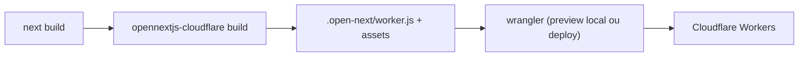

# Arquitetura

> Estado: **Fase 0 — scaffold**. Este documento descreve apenas o que existe hoje
> no repositório. Para o que está planejado (catálogo, sacola, auth, R2, IA,
> banco), ver `specs/00-constitution.md` e os ADRs em `specs/adr/`.

## Visão leiga

O Roseshop ainda é só o esqueleto gerado pelo template oficial do OpenNext para
Cloudflare (`create-next-app` + `@opennextjs/cloudflare`). Hoje, ao acessar o
site, a única coisa que existe é a página inicial padrão do Next.js — nenhuma
tela de catálogo, login ou painel foi construída ainda.

O que já está de pé é a **esteira de build e deploy**: como o projeto, escrito
em Next.js, vira um Worker rodando na Cloudflare.

## Aprofundamento técnico

### Stack e versões (confirmado em `package.json`)

| Peça | Versão/pacote |
|---|---|
| Next.js | `16.3.8` (App Router, Turbopack) |
| React | `^19.1.7` |
| TypeScript | `^5.7.4` (modo `strict`, `target: es2024`) |
| Adaptador Cloudflare | `@opennextjs/cloudflare` `^1.20.3` |
| Wrangler (CLI Cloudflare) | `^4.147.0` |
| Tailwind CSS | `^4` (via `@tailwindcss/postcss`) |
| Lint | ESLint `^9`, flat config (`eslint-config-next`) |

Não há ainda: Drizzle/banco, Auth.js, SDK da OpenAI, nem nenhuma lib de upload
para R2 — essas entram nas dependências quando as features correspondentes
(ver `specs/`) forem implementadas.

### Estrutura de código atual

```
src/app/
  layout.tsx    # layout raiz (fonts Geist via next/font/google, <html lang="en">)
  page.tsx      # página inicial — ainda é o boilerplate do create-next-app
  globals.css   # estilos globais (Tailwind)
```

Nenhuma rota além da raiz, nenhum middleware, nenhum diretório `src/lib/`.

### Build e deploy (OpenNext + Wrangler)

O fluxo de build é o padrão do adaptador `@opennextjs/cloudflare`:



- `next.config.ts` chama `initOpenNextCloudflareForDev()` — isso é o que permite
  usar `getCloudflareContext()` (acesso a bindings) rodando `next dev`, mesmo
  esse não sendo o runtime real de produção.
- `open-next.config.ts` usa `defineCloudflareConfig()` sem overrides. Há um
  comentário indicando que o cache incremental via R2
  (`r2-incremental-cache`) está disponível mas **desativado** — ninguém
  habilitou ainda.
- `wrangler.jsonc` define o worker `roseshop`, com:
  - `assets` — binding `ASSETS`, servindo `.open-next/assets` (estáticos).
  - `images` — binding `IMAGES`, para otimização de imagem do Next via Cloudflare
    Images (habilitado, mas nada no app ainda usa `next/image` além do boilerplate).
  - `services` — binding `WORKER_SELF_REFERENCE`, auto-referência do worker a
    si mesmo (`roseshop`), usada pelo OpenNext para caching (ver
    [docs do OpenNext](https://opennext.js.org/cloudflare/caching)).
  - `observability.enabled: true` e `upload_source_maps: true`.
  - `compatibility_date: "2026-10-01"` e flag `global_fetch_strictly_public`.
- `public/_headers` aplica cache imutável de 1 ano para `/_next/static/*`
  (arquivo lido pelo asset handler do Workers, não pelo Next).

Nenhum binding de banco (Neon/Hyperdrive), R2 (storage) ou segredo de IA existe
ainda em `wrangler.jsonc` — eles entram junto com as features que os usam
(F0x de catálogo/imagens/IA, conforme `specs/`).

### Divergência com ADR-006 (alerta ao tech-lead)

`specs/adr/006-ambientes-dev-producao.md` decide que dev e produção são dois
workers Cloudflare separados (`roseshop-dev` e `roseshop`), cada um com seus
próprios bindings declarados "por environment (não são herdados)". O
`wrangler.jsonc` atual **não tem blocos `env` nenhum** — só a configuração
top-level de um único worker chamado `roseshop`, que seria a configuração de
produção. Ainda não há `env.dev` nem worker `roseshop-dev` configurados. Isso
é esperado em Fase 0 (ainda não há CI nem ambiente dev real), mas fica
registrado para quando a ADR-006 for implementada de fato.

### Ambientes (planejado, ver ADR-006)

Dev local roda `next dev` ou `npm run preview` (workerd local) usando
`.dev.vars`. Banco (Neon), storage (R2) e IA (OpenAI) com credenciais
separadas de produção e pipeline de CI por ambiente (`dev`/`production`) via
GitHub Actions — nada disso está implementado ainda; ver `specs/adr/
006-ambientes-dev-producao.md` para o desenho completo.

### Dívidas técnicas

- **`<html lang="en">` em `src/app/layout.tsx`**: o produto é pt-BR, mas o
  layout raiz declara `lang="en"` (herança do `create-next-app`). Afeta
  leitores de tela e SEO. Também permanecem `title`/`description` genéricos
  ("Create Next App") em `metadata`. Corrigir ao implementar a primeira tela.

### Planejado, não implementado

Catálogo público, sacola, autenticação (Auth.js + allowlist `ADMIN_EMAILS`),
upload de imagens via R2 (URL pré-assinada) e integração de IA (OpenAI) são
descritos em `specs/00-constitution.md` (seção "Stack fechada") mas **não têm
nenhum código correspondente** neste repositório ainda. Não documentamos
comportamento aqui até existir implementação.
