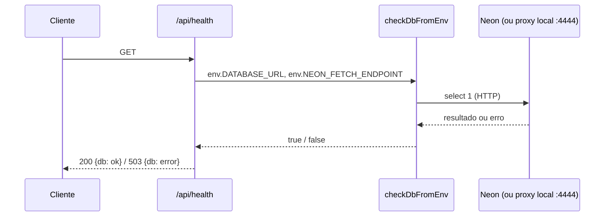
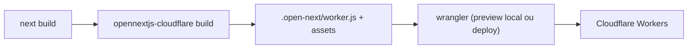

# Arquitetura

> Estado: **Fase 0 — scaffold**. Este documento descreve apenas o que existe hoje
> no repositório. Para o que está planejado (catálogo, sacola, auth, R2, IA,
> banco), ver `.specify/memory/constitution.md` e os ADRs em `specs/adr/`.

## Visão leiga

O Roseshop ainda é só o esqueleto gerado pelo template oficial do OpenNext para
Cloudflare (`create-next-app` + `@opennextjs/cloudflare`). Hoje, ao acessar o
site, a única coisa que existe é a página inicial padrão do Next.js — nenhuma
tela de catálogo, login ou painel foi construída ainda.

O que já está de pé é a **esteira de build e deploy**: como o projeto, escrito
em Next.js, vira um Worker rodando na Cloudflare.

## Aprofundamento técnico

### Stack e versões (confirmado em `package.json`)

| Peça | Versão/pacote |
|---|---|
| Next.js | `16.3.8` (App Router, Turbopack) |
| React | `^19.1.7` |
| TypeScript | `^5.7.4` (modo `strict`, `target: es2024`) |
| Adaptador Cloudflare | `@opennextjs/cloudflare` `^1.20.3` |
| Wrangler (CLI Cloudflare) | `^4.147.0` |
| Tailwind CSS | `^4` (via `@tailwindcss/postcss`) |
| Lint | ESLint `^9`, flat config (`eslint-config-next`) |
| Testes | Vitest `^5.0.3` + Testing Library + jsdom (ver [operacao.md, "Testes"](./operacao.md#testes-vitest)) |

Banco: `drizzle-orm` `^0.45.3` e `@neondatabase/serverless` `^1.2.0` (runtime);
`drizzle-kit` `^0.31.11` e `pg` `^8.23.1` (dev, só migrations). Não há ainda no `package.json`: Auth.js, SDK da OpenAI, nem nenhuma lib de upload
para R2 — essas entram nas dependências quando as features correspondentes
(ver `specs/`) forem implementadas.

### Estrutura de código atual

```
src/app/
  layout.tsx    # layout raiz (fonts Geist via next/font/google, <html lang="en">)
  page.tsx      # página inicial — ainda é o boilerplate do create-next-app
  globals.css   # estilos globais (Tailwind)
  api/health/route.ts   # GET /api/health (ver "Camada de banco")
src/lib/db/
  client.ts     # createDb: Drizzle + driver HTTP do Neon
  health.ts     # checkDb: select 1
  schema.ts     # schema Drizzle — vazio de propósito (Fase 0.4)
  *.test.ts / *.int.test.ts   # testes unitário e de integração
drizzle.config.ts   # config do drizzle-kit (migrations em src/lib/db/migrations)
```

Nenhuma rota além da raiz e de `/api/health`, nenhum middleware.

### Camada de banco e health check

**Visão leiga**: o app já sabe "conversar" com o banco, mas ainda não guarda
nada. A única prova disso é o endereço `/api/health`, que responde se o banco
está de pé (útil para monitoramento e para checar o ambiente).

**Aprofundamento técnico** (zona protegida: `src/lib/db/`):

| Rota / função | Arquivo | O que faz |
|---|---|---|
| `GET /api/health` | `src/app/api/health/route.ts` | Lê `env` via `getCloudflareContext({ async: true })` e chama `checkDbFromEnv`. Responde `{db: "ok"}` com 200 ou `{db: "error"}` com 503, sempre com `Cache-Control: no-store`; `dynamic = "force-dynamic"`. |
| `createDb(env)` | `src/lib/db/client.ts` | Exige `DATABASE_URL` (lança erro se vazia). Se `NEON_FETCH_ENDPOINT` existir, seta `neonConfig.fetchEndpoint` (proxy local); senão usa o endpoint padrão do Neon. Retorna `drizzle({ client: neon(url), schema })` (`drizzle-orm/neon-http`). |
| `checkDbFromEnv(env)` | `src/lib/db/health.ts` | Chama `createDb` dentro de try/catch: configuração ausente ou inválida registra `[health] configuração do banco ausente ou inválida` e devolve `false` (503), **sem lançar**. Senão delega a `checkDb`. |
| `checkDb(db)` | `src/lib/db/health.ts` | Executa `select 1`; em falha registra só o `error.name` (a mensagem do driver pode conter host/usuário) e devolve `false`. |



Migrations: `drizzle-kit` (`drizzle.config.ts`) usa o driver `pg` por **TCP
direto** (não o proxy HTTP), conforme ADR-002, e escreve em
`src/lib/db/migrations/` (ainda não existe: schema vazio, nada gerado).
Validado no workerd: `npm run preview` -> `/api/health` 200 `{db: ok}`.

Pegadinhas e dívidas:

- `cloudflare-env.d.ts` (gerado pelo `cf-typegen` a partir do `.dev.vars`
  local) tipa `NEON_FETCH_ENDPOINT` como `string` obrigatória, mas ela não
  existe em dev online e produção; `DbEnv` a trata como opcional. Cuidado ao
  confiar no tipo gerado.
- `createDb` muda `neonConfig` global (estado de módulo) a cada chamada
  quando `NEON_FETCH_ENDPOINT` está definida.

### Build e deploy (OpenNext + Wrangler)

O fluxo de build é o padrão do adaptador `@opennextjs/cloudflare`:



- `next.config.ts` chama `initOpenNextCloudflareForDev()` — isso é o que permite
  usar `getCloudflareContext()` (acesso a bindings) rodando `next dev`, mesmo
  esse não sendo o runtime real de produção.
- `open-next.config.ts` usa `defineCloudflareConfig()` sem overrides. Há um
  comentário indicando que o cache incremental via R2
  (`r2-incremental-cache`) está disponível mas **desativado** — ninguém
  habilitou ainda.
- `wrangler.jsonc` tem **três ambientes** (detalhes e comandos em
  [operacao.md, "Deploy"](./operacao.md#deploy)): o nível de cima é o **local**
  (worker `roseshop-local`), `env.dev` é `roseshop-dev` e `env.production` é
  `roseshop`. Bindings são redeclarados por env, com o mesmo nome; `ASSETS` é
  herdado. O nível de cima declara:
  - `assets` — binding `ASSETS`, servindo `.open-next/assets` (estáticos).
  - `images` — binding `IMAGES`, para otimização de imagem do Next via Cloudflare
    Images (habilitado, mas nada no app ainda usa `next/image` além do boilerplate).
  - `services` — binding `WORKER_SELF_REFERENCE`, auto-referência do worker a
    si mesmo (`roseshop-local` no nível de cima; cada env aponta para o seu), usada pelo OpenNext para caching (ver
    [docs do OpenNext](https://opennext.js.org/cloudflare/caching)).
  - `observability.enabled: true` e `upload_source_maps: true`.
  - `r2_buckets` — binding `PRODUCT_IMAGES` (local `roseshop-local`, simulado;
    dev `roseshop-dev`; produção `roseshop-prod`). Declarado, mas **nenhum
    código o usa ainda**.
  - `compatibility_date: "2026-10-01"` e flag `global_fetch_strictly_public`.
- `public/_headers` aplica cache imutável de 1 ano para `/_next/static/*`
  (arquivo lido pelo asset handler do Workers, não pelo Next).

Não há binding de banco (Neon/Hyperdrive) nem segredo de IA em `wrangler.jsonc`
(o banco é acessado por `DATABASE_URL`, secret/var, via HTTP); eles entram junto
com as features que os usam (conforme `specs/`).

### Ambientes decididos nos ADRs 002 e 006 (parcialmente implementados)

A constitution (princípio VIII) e o ADR-006 (revisado) definem **três camadas
isoladas**. Hoje existem no repositório o `preview`, os três ambientes no
`wrangler.jsonc` (worker dev publicado) e a stack Docker local de banco (`docker-compose.yml`, detalhada em
[operacao.md, "Banco local"](./operacao.md#banco-local-docker)); o app ainda
não se conecta a ela.

| Recurso | Local | Dev online | Produção |
|---|---|---|---|
| Runtime | `npm run preview` (workerd) | Worker `roseshop-dev` | Worker `roseshop` |
| Banco | Postgres em Docker (ADR-002) | Neon, branch `dev` | Neon, branch `production` |
| Imagens | R2 simulado pelo wrangler (`.wrangler/state/`) | R2 `roseshop-dev` | R2 `roseshop-prod` |
| OpenAI | chave dev, limite baixo | chave dev, limite baixo | chave prod |
| Segredos | `.dev.vars` | `wrangler secret --env dev` | `wrangler secret --env production` |
| Login | Google, callback `localhost` | Google, callback dev | Google, callback produção |

Pontos-chave:

- **Banco (ADR-002)**: Postgres em todas as camadas, com um único driver,
  `@neondatabase/serverless` (HTTP). No local, o Postgres do Docker é exposto
  por um proxy HTTP compatível com o protocolo do Neon no mesmo
  `docker-compose` (implementado: Postgres 18 + proxy em `127.0.0.1:4444`); o
  endpoint vem de variável de ambiente (`NEON_FETCH_ENDPOINT`, só no local),
  sem ramificação no código. Migrations (Drizzle + `drizzle-kit`) são SQL versionado, aplicado
  local → dev → produção, usando conexão direta (não o proxy).
- **Entrega (ADR-006)**: PR → CI (lint, typecheck, testes) → migration no Neon
  `dev` → deploy em `roseshop-dev`; merge em `main` (humano) → migration no
  Neon `production` → deploy em `roseshop`. Segredos de deploy em GitHub
  Environments; segredos de runtime só na Cloudflare.
- **Regras**: a máquina local nunca acessa dev online nem produção; bindings
  do wrangler são declarados por environment (não herdados) e
  `WORKER_SELF_REFERENCE` aponta para o worker do próprio ambiente; mudança
  destrutiva de schema segue expand/contract.
- **Cota compartilhada**: os limites do free tier da Cloudflare são da conta,
  então dev e produção disputam a mesma cota; teste de carga roda só na stack
  Docker local.

### Divergência com ADR-006 (alerta ao tech-lead)

Os blocos `env` do `wrangler.jsonc` (`dev` e `production`) **já existem**
(commit `fffa3fe`) e o `docker-compose.yml` é consistente com o ADR-002. O que
falta é o **workflow de CI** (GitHub Actions); o worker `roseshop` (produção)
só será criado por ele. Nota: `scripts/require-ci.mjs` já bloqueia o deploy
manual de produção. Fica registrado até o CI existir.

**Risco resolvido**: a flag `global_fetch_strictly_public` em
`wrangler.jsonc` **não** bloqueia o `fetch` do worker ao proxy local
(`localhost:4444`), validado no `preview` (ver
[operacao.md, "Banco local"](./operacao.md#banco-local-docker)).

### Processo de especificação (Spec Kit)

O repositório adotou o Spec Kit (v1.0.6, integração `claude`):

| Caminho | Papel |
|---|---|
| `.specify/memory/constitution.md` | Constitution v1.0.0 (princípios I a VIII); fonte das regras não negociáveis. Substitui o antigo `specs/00-constitution.md`, que não existe mais. |
| `.specify/templates/` | Templates de spec, plan, tasks, checklist e constitution. |
| `.specify/scripts/bash/` | Scripts usados pelas skills (criar feature, pré-requisitos, setup de plan/tasks). |
| `.specify/workflows/`, `.specify/*.json` | Workflow e estado/manifestos da integração. |
| `.claude/skills/speckit-*` | Skills `/speckit-specify`, `clarify`, `plan`, `tasks`, `analyze`, `implement`, `converge`, `checklist`, `constitution`, `taskstoissues`. |
| `specs/NNN-nome/` | Uma pasta por feature (`spec.md`, `plan.md`, `tasks.md`). Hoje nenhuma existe. |
| `specs/adr/` | ADRs: hoje `002-neon-drizzle.md` e `006-ambientes-dev-producao.md`. |

O `plan.md` de cada feature passa pelo Constitution Check. A ordem de uso está
no `CLAUDE.md`, seção "Spec Kit". Mapeamento da numeração antiga da
constitution para a nova: seção 4 = III (Segurança), 5 = IV, 6 = V, 7 = VI,
8 = VII (Ambiente e plataforma), 9 = VIII (Ambientes).

### Dívidas técnicas

- **`<html lang="en">` em `src/app/layout.tsx`**: o produto é pt-BR, mas o
  layout raiz declara `lang="en"` (herança do `create-next-app`). Afeta
  leitores de tela e SEO. Também permanecem `title`/`description` genéricos
  ("Create Next App") em `metadata`. Corrigir ao implementar a primeira tela.

### Planejado, não implementado

Catálogo público, sacola, autenticação (Auth.js + allowlist `ADMIN_EMAILS`),
upload de imagens via R2 (URL pré-assinada) e integração de IA (OpenAI) são
descritos em `.specify/memory/constitution.md` (princípio II, "Stack fechada") mas **não têm
nenhum código correspondente** neste repositório ainda. Não documentamos
comportamento aqui até existir implementação.
