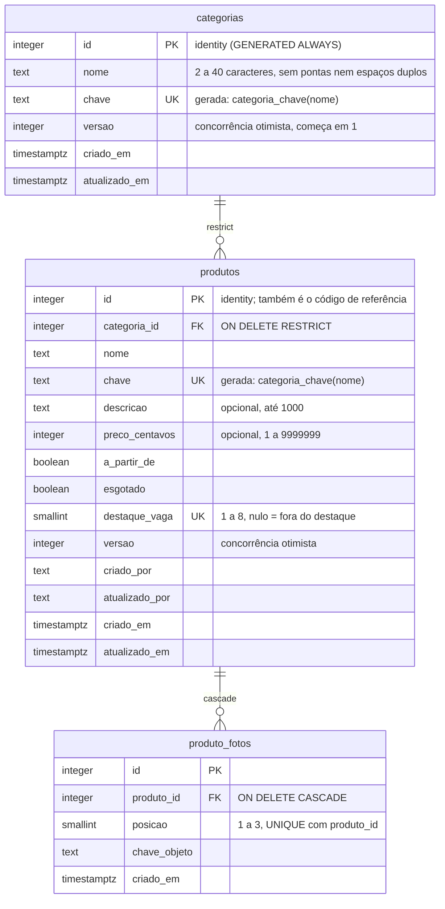

# Banco de dados

> Estado: **três tabelas** — `categorias` (feature 002), `produtos` e
> `produto_fotos` (feature 003) — e uma função SQL (`categoria_chave`). A
> migration `0000` cria a função, `categorias` e o seed; a `0001` cria `produtos`
> e `produto_fotos`. A sessão de login é JWT e não tem tabelas
> ([F01](./features/F01-autenticacao.md)). Fonte do schema:
> `src/lib/db/schema.ts`.

## Visão leiga

O banco guarda a **lista de categorias da loja** (Bolsas, Meias,
Tupperware etc.) e os **produtos** de cada categoria. Cada categoria tem um nome e um número interno (`id`). O banco
mesmo impede duas categorias com "o mesmo nome" (ignorando maiúsculas, acentos,
espaços extras e hífen no lugar de espaço): "Panos de Prato" e "panos de prato"
são a mesma categoria. A migration já traz a lista inicial (cinco categorias),
então um banco recém-criado nunca nasce vazio.

Cada produto pertence a uma categoria, tem um nome único (mesma regra de
equivalência das categorias), descrição e preço opcionais, a marca de esgotado e
uma vaga de destaque (1 a 8, no máximo oito produtos em destaque). O banco
recusa nome fora de 3 a 80 letras, preço fora da faixa, destaque de produto
esgotado e uma categoria apagada enquanto tem produtos. A tabela de fotos já
existe, mas fica vazia até a feature 004.

## Aprofundamento técnico

### Modelo

### Tabela `categorias`

Definida em `src/lib/db/schema.ts`; SQL real em
`src/lib/db/migrations/0000_naive_dragon_man.sql`.

| Coluna | Tipo | Regras |
|---|---|---|
| `id` | `integer` | PK, `GENERATED ALWAYS AS IDENTITY`. |
| `nome` | `text` | `NOT NULL`. Checks: `categorias_nome_tamanho` (`char_length` entre 2 e 40), `categorias_nome_sem_pontas` (igual ao `btrim`), `categorias_nome_sem_espacos_duplos` (sem `\s{2,}`). |
| `chave` | `text` | `GENERATED ALWAYS AS (categoria_chave(nome)) STORED`, `NOT NULL`, constraint `categorias_chave_unique`. Nenhum código a grava. |
| `versao` | `integer` | `NOT NULL DEFAULT 1`. Incrementada a cada renomeação; entra no `WHERE` do `UPDATE`/`DELETE` (FR-019). |
| `criado_em` / `atualizado_em` | `timestamptz` | `NOT NULL DEFAULT now()`. `atualizado_em` é atualizado pela query de renomear (não há trigger). |

### Função `categoria_chave(text)` e a regra de equivalência

`IMMUTABLE`, `STRICT`, `PARALLEL SAFE`, só com built-ins: minúscula, `normalize`
NFD, remoção das marcas combinantes `U+0300–U+036F`, hífen vira espaço, colapso
de espaços e `btrim`. Vive **só na migration** (o `drizzle-kit` não modela
funções); o `schema.ts` declara a coluna gerada com `generatedAlwaysAs` apenas
para o kit não propor removê-la. Decisão e alternativas descartadas:
[ADR-008](../specs/adr/008-integridade-de-dados-neon-http.md).

Consequências práticas:

- A unicidade é do banco (`UNIQUE(chave)`), inclusive sob concorrência. O código
  só reage ao SQLSTATE `23505` e busca o nome já gravado com
  `chave = categoria_chave($1)` (uma só implementação da regra).
- Alterar o **corpo** da função não recalcula valores já gravados: mudar a regra
  exige migration nova que recrie a coluna gerada e o índice.
- Caracteres que o NFD não decompõe (`ß`, `æ`, `ø`, `ł`) permanecem distintos.
- Listagem: `ORDER BY chave COLLATE "C", id`, independente do locale do servidor.

### Migration `0000` e seed

Gerada pelo `drizzle-kit generate` e **editada à mão** (emenda do ADR-008): a
função vem antes do `CREATE TABLE` e o seed depois, entre os marcadores
`-- seed:categorias:start` / `-- seed:categorias:end`. Seed: Bolsas,
Guarda-chuvas, Tupperware, Panos de prato, Meias. Como o seed é parte da
migration, ele roda uma única vez por banco (o drizzle registra a migration
aplicada): categoria removida ou renomeada **não volta** em deploys seguintes.
Os testes de integração leem o bloco entre os marcadores para recriar o estado
inicial (`src/test/db/categorias-fixtures.ts`).

Pegadinhas:

- Depois de editar uma migration gerada, rode `db:generate` de novo e confira
  que o kit diz "No schema changes" (a função manual não pode virar diff).
- A migration `0000` é **congelada** no Neon dev a partir do primeiro run do PR
  da feature 002 (CI aplica `db:migrate`); mudança posterior exige migration
  nova, nunca edição da `0000`.

### Tabela `produtos`

Definida em `src/lib/db/schema.ts`; SQL real em
`src/lib/db/migrations/0001_premium_boomerang.sql` (gerada pelo `drizzle-kit`,
sem edição manual; a `chave` reaproveita `categoria_chave` da `0000`).

| Coluna | Tipo | Regras |
|---|---|---|
| `id` | `integer` | PK, `GENERATED ALWAYS AS IDENTITY`. É o código de referência (`#0042` é só formatação). |
| `categoria_id` | `integer` | `NOT NULL`, FK para `categorias.id` com `ON DELETE RESTRICT` explícito (o padrão do Drizzle seria `NO ACTION`). Índice `produtos_categoria_id_idx`. |
| `nome` | `text` | `NOT NULL`. Checks `produtos_nome_tamanho` (3 a 80), `produtos_nome_sem_pontas`, `produtos_nome_sem_espacos_duplos`. |
| `chave` | `text` | Gerada (`categoria_chave(nome)`), `NOT NULL`, `produtos_chave_unique`. Nunca entra em `SET`. |
| `descricao` | `text` | Nulável; `produtos_descricao_tamanho` (até 1000). |
| `preco_centavos` | `integer` | Nulável; `produtos_preco_faixa` (1 a 9.999.999). |
| `a_partir_de` | `boolean` | `NOT NULL DEFAULT false`; `produtos_a_partir_de_com_preco` exige preço quando verdadeiro. |
| `esgotado` | `boolean` | `NOT NULL DEFAULT false`. |
| `destaque_vaga` | `smallint` | Nulável (fora do destaque). `produtos_destaque_vaga_faixa` (1 a 8) e índice único parcial `produtos_destaque_vaga_unique` (`WHERE destaque_vaga IS NOT NULL`): é isso que impõe o teto de 8 e a vaga única. `produtos_destaque_disponivel`: esgotado não pode ter vaga. |
| `versao` | `integer` | `NOT NULL DEFAULT 1`; todo writer soma 1 e a confere no `WHERE`. |
| `criado_por` / `atualizado_por` | `text` | `NOT NULL`; e-mail da sessão. |
| `criado_em` / `atualizado_em` | `timestamptz` | `NOT NULL DEFAULT now()`; `atualizado_em` é gravado pela query (sem trigger). |

### Tabela `produto_fotos`

Só modelo nesta feature (nenhum código grava; a 004 liga R2). `id` identity;
`produto_id` FK com `ON DELETE CASCADE` (remover produto leva as fotos);
`posicao` 1 a 3 (`produto_fotos_posicao_faixa`), `UNIQUE(produto_id, posicao)`;
`chave_objeto` `text NOT NULL` (chave do objeto no R2); `criado_em`.

### Regras de exclusão e integridade

| Regra | Onde é garantida |
|---|---|
| Nome único por equivalência (FR-005) | Banco: `UNIQUE(chave)` sobre coluna gerada. |
| Nome 2 a 40 caracteres, sem pontas/espaços duplos | Banco (checks) e Zod (`src/lib/categorias/nome.ts`). |
| Edição simultânea da mesma categoria (FR-019) | Coluna `versao` no `WHERE` de `UPDATE`/`DELETE`. |
| Sempre ao menos uma categoria (FR-020) | **Aplicação**: `db.batch` com `pg_advisory_xact_lock` + `DELETE ... WHERE (SELECT count(*)) > 1` em `remover` (`src/lib/db/categorias.ts`). Um `DELETE` por SQL manual contorna a regra. |
| Categoria com produtos não pode ser removida (FR-011) | Banco: FK `produtos.categoria_id` `ON DELETE RESTRICT` (SQLSTATE `23001`). |
| Nome de produto único por equivalência | Banco: `UNIQUE(chave)` (23505); o código busca o existente só para a mensagem. |
| No máximo 8 produtos em destaque, cada um em uma vaga | Banco: `destaque_vaga` 1 a 8 + índice único parcial; `destacar` escolhe a menor vaga livre no `UPDATE` ([F03](./features/F03-produtos.md#concorrência-destaque-e-status)). |
| Esgotado não fica em destaque | Banco (`produtos_destaque_disponivel`) e `esgotar`, que zera a vaga no mesmo `UPDATE`. |
| Edição simultânea de produto | Coluna `versao` no `WHERE` de `UPDATE`/`DELETE`. |

O driver é `neon-http`: **não há `db.transaction()`**. Só statements isolados e
`db.batch([...])` (uma transação `READ COMMITTED`, sem decidir o próximo
statement pelo resultado do anterior). Chaves de lock advisory ficam
registradas em `src/lib/db/locks.ts` (`LOCK_PROBE_BATCH = 2001`,
`LOCK_REMOCAO_CATEGORIAS = 2002`); número nunca é reutilizado.

### FK de produtos e a remoção de categorias

`BLOQUEIO_POR_PRODUTOS` em `src/lib/db/categorias.ts` só reconhece o SQLSTATE
**`23001`** (`restrict_violation`); o padrão `NO ACTION` geraria `23503`, não
tratado. Por isso a FK declara `RESTRICT` e `contarProdutosDaCategoria` usa o
schema Drizzle de `produtos`. O fato "FK `RESTRICT` ⇒ `23001`, e o `db.batch`
reverte tudo" é provado por `src/lib/db/fk-produtos.int.test.ts`, que roda no
proxy local (`npm run test:int`) **e no Neon dev pelo CI do PR**
(`vitest.probe.config.mts`; ver [operacao.md, "CI"](./operacao.md#ci)).

Pegadinhas do schema de produtos:

- A migration `0001` fica **congelada** no Neon dev a partir do primeiro run do
  PR da feature 003; mudança depois disso exige migration nova.
- Alterar o corpo de `categoria_chave` afeta categorias **e** produtos (duas
  colunas geradas); a regra de recriar coluna e índice vale para as duas.
- Premissa de código: todo writer de `produtos` incrementa `versao`
  (`saiuDoDestaque` e a precedência de mensagens dependem disso).

### Como o código acessa o banco

Camadas e proibições de import em
[F02-categorias.md](./features/F02-categorias.md#camadas-e-fronteira-de-acesso).
Cliente e health check em
[architecture.md, "Camada de banco"](./architecture.md#camada-de-banco-e-health-check).
Comandos (`db:generate`, `db:migrate`, `db:reset`) em
[operacao.md](./operacao.md#comandos-packagejson).
