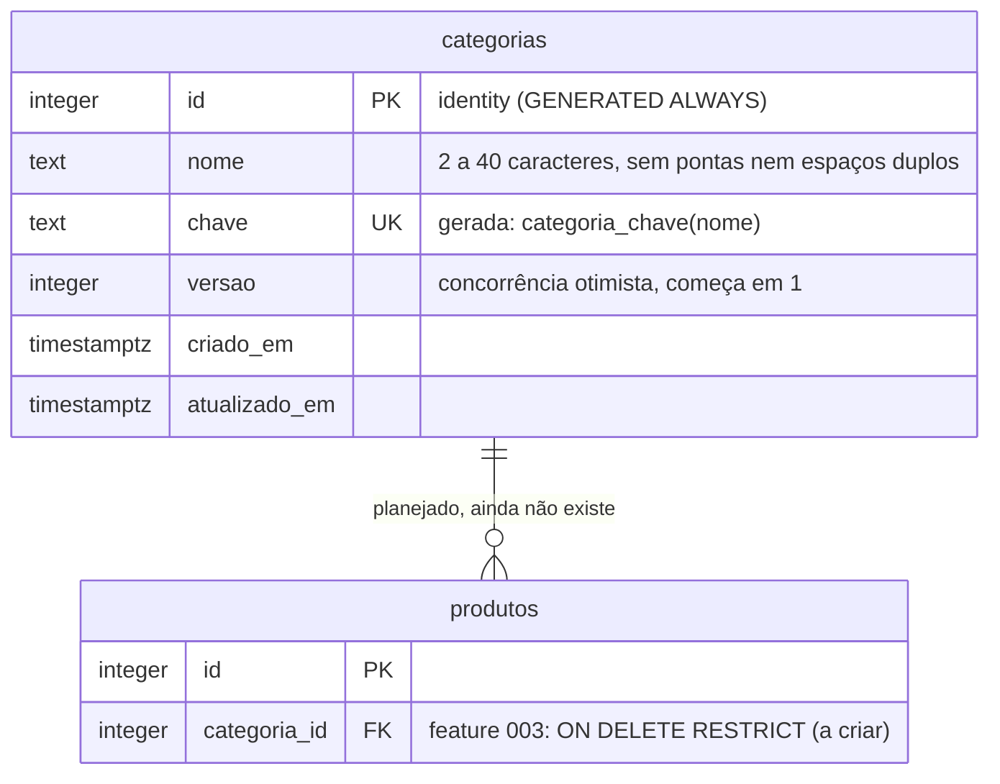

# Banco de dados

> Estado: **uma tabela** (`categorias`, feature 002) e uma função SQL
> (`categoria_chave`), criadas pela migration `0000`. A sessão de login é JWT e
> não tem tabelas ([F01](./features/F01-autenticacao.md)). Produtos ainda não
> existem (feature 003). Fonte do schema: `src/lib/db/schema.ts`.

## Visão leiga

O banco guarda hoje só a **lista de categorias da loja** (Bolsas, Meias,
Tupperware etc.). Cada categoria tem um nome e um número interno (`id`). O banco
mesmo impede duas categorias com "o mesmo nome" (ignorando maiúsculas, acentos,
espaços extras e hífen no lugar de espaço): "Panos de Prato" e "panos de prato"
são a mesma categoria. A migration já traz a lista inicial (cinco categorias),
então um banco recém-criado nunca nasce vazio.

## Aprofundamento técnico

### Modelo

`produtos` está no diagrama só para marcar o contrato com a feature 003; **a
tabela não existe** no schema nem em migration (ver "Aviso para a feature 003").

### Tabela `categorias`

Definida em `src/lib/db/schema.ts`; SQL real em
`src/lib/db/migrations/0000_naive_dragon_man.sql`.

| Coluna | Tipo | Regras |
|---|---|---|
| `id` | `integer` | PK, `GENERATED ALWAYS AS IDENTITY`. |
| `nome` | `text` | `NOT NULL`. Checks: `categorias_nome_tamanho` (`char_length` entre 2 e 40), `categorias_nome_sem_pontas` (igual ao `btrim`), `categorias_nome_sem_espacos_duplos` (sem `\s{2,}`). |
| `chave` | `text` | `GENERATED ALWAYS AS (categoria_chave(nome)) STORED`, `NOT NULL`, constraint `categorias_chave_unique`. Nenhum código a grava. |
| `versao` | `integer` | `NOT NULL DEFAULT 1`. Incrementada a cada renomeação; entra no `WHERE` do `UPDATE`/`DELETE` (FR-019). |
| `criado_em` / `atualizado_em` | `timestamptz` | `NOT NULL DEFAULT now()`. `atualizado_em` é atualizado pela query de renomear (não há trigger). |

### Função `categoria_chave(text)` e a regra de equivalência

`IMMUTABLE`, `STRICT`, `PARALLEL SAFE`, só com built-ins: minúscula, `normalize`
NFD, remoção das marcas combinantes `U+0300–U+036F`, hífen vira espaço, colapso
de espaços e `btrim`. Vive **só na migration** (o `drizzle-kit` não modela
funções); o `schema.ts` declara a coluna gerada com `generatedAlwaysAs` apenas
para o kit não propor removê-la. Decisão e alternativas descartadas:
[ADR-008](../specs/adr/008-integridade-de-dados-neon-http.md).

Consequências práticas:

- A unicidade é do banco (`UNIQUE(chave)`), inclusive sob concorrência. O código
  só reage ao SQLSTATE `23505` e busca o nome já gravado com
  `chave = categoria_chave($1)` (uma só implementação da regra).
- Alterar o **corpo** da função não recalcula valores já gravados: mudar a regra
  exige migration nova que recrie a coluna gerada e o índice.
- Caracteres que o NFD não decompõe (`ß`, `æ`, `ø`, `ł`) permanecem distintos.
- Listagem: `ORDER BY chave COLLATE "C", id`, independente do locale do servidor.

### Migration `0000` e seed

Gerada pelo `drizzle-kit generate` e **editada à mão** (emenda do ADR-008): a
função vem antes do `CREATE TABLE` e o seed depois, entre os marcadores
`-- seed:categorias:start` / `-- seed:categorias:end`. Seed: Bolsas,
Guarda-chuvas, Tupperware, Panos de prato, Meias. Como o seed é parte da
migration, ele roda uma única vez por banco (o drizzle registra a migration
aplicada): categoria removida ou renomeada **não volta** em deploys seguintes.
Os testes de integração leem o bloco entre os marcadores para recriar o estado
inicial (`src/test/db/categorias-fixtures.ts`).

Pegadinhas:

- Depois de editar uma migration gerada, rode `db:generate` de novo e confira
  que o kit diz "No schema changes" (a função manual não pode virar diff).
- A migration `0000` é **congelada** no Neon dev a partir do primeiro run do PR
  da feature 002 (CI aplica `db:migrate`); mudança posterior exige migration
  nova, nunca edição da `0000`.

### Regras de exclusão e integridade

| Regra | Onde é garantida |
|---|---|
| Nome único por equivalência (FR-005) | Banco: `UNIQUE(chave)` sobre coluna gerada. |
| Nome 2 a 40 caracteres, sem pontas/espaços duplos | Banco (checks) e Zod (`src/lib/categorias/nome.ts`). |
| Edição simultânea da mesma categoria (FR-019) | Coluna `versao` no `WHERE` de `UPDATE`/`DELETE`. |
| Sempre ao menos uma categoria (FR-020) | **Aplicação**: `db.batch` com `pg_advisory_xact_lock` + `DELETE ... WHERE (SELECT count(*)) > 1` em `remover` (`src/lib/db/categorias.ts`). Um `DELETE` por SQL manual contorna a regra. |
| Categoria com produtos não pode ser removida (FR-011) | Banco, na feature 003: FK `ON DELETE RESTRICT` (SQLSTATE `23001`). |

O driver é `neon-http`: **não há `db.transaction()`**. Só statements isolados e
`db.batch([...])` (uma transação `READ COMMITTED`, sem decidir o próximo
statement pelo resultado do anterior). Chaves de lock advisory ficam
registradas em `src/lib/db/locks.ts` (`LOCK_PROBE_BATCH = 2001`,
`LOCK_REMOCAO_CATEGORIAS = 2002`); número nunca é reutilizado.

### Aviso para a feature 003 (FK de produtos)

`produtos.categoria_id → categorias.id` **precisa** de `ON DELETE RESTRICT`
explícito. O código de remoção só reconhece o SQLSTATE **`23001`**
(`restrict_violation`); o padrão `NO ACTION` gera `23503`, que **não** é tratado
(`BLOQUEIO_POR_PRODUTOS` em `src/lib/db/categorias.ts`) e viraria erro genérico
em vez da mensagem "tem N produtos". Pendências registradas na 002 para a 003:

- `contarProdutosDaCategoria` usa SQL cru (`FROM produtos`); trocar pela
  referência ao schema Drizzle de `produtos`.
- A primeira task da 003 remove `criarFixtureProdutos`/`descartarFixtureProdutos`
  de `src/test/db/categorias-fixtures.ts` (a fixture usa `CREATE TABLE produtos`
  sem `IF NOT EXISTS` e falha de propósito se a tabela real existir).
- Teste de integração da FK `ON DELETE RESTRICT` gerando `23001` **no Neon dev,
  via CI**: o probe da 002 só prova a forma do erro no `db.batch` (com `23001`
  via `RAISE`, sem tabela); o fato "FK RESTRICT ⇒ 23001" foi provado só no
  proxy local.

### Como o código acessa o banco

Camadas e proibições de import em
[F02-categorias.md](./features/F02-categorias.md#camadas-e-fronteira-de-acesso).
Cliente e health check em
[architecture.md, "Camada de banco"](./architecture.md#camada-de-banco-e-health-check).
Comandos (`db:generate`, `db:migrate`, `db:reset`) em
[operacao.md](./operacao.md#comandos-packagejson).
