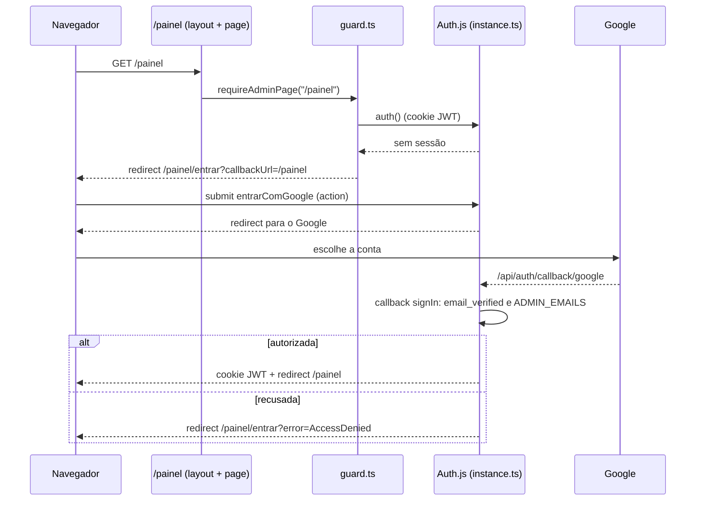

# F01 — Autenticação das administradoras

> Estado: **implementada** no branch `feature/001-auth-admins`. Spec:
> [`specs/001-auth-admins/spec.md`](../../specs/001-auth-admins/spec.md); contrato
> em `specs/001-auth-admins/contracts/auth.md`; decisões em
> [`specs/adr/003-authjs-google-allowlist.md`](../../specs/adr/003-authjs-google-allowlist.md)
> (incluindo os adendos). O único conteúdo do painel hoje é a saudação
> "Olá, <nome>": o catálogo e o resto do painel são features futuras.

## Visão leiga

O painel da loja (`/painel`) é só para as administradoras. Quem abre o painel
sem estar conectada vê uma tela com um botão "Entrar com Google". Depois de
escolher a conta no Google, o sistema confere se o e-mail está na **lista de
administradoras autorizadas** (a variável `ADMIN_EMAILS`):

- Está na lista: entra no painel, e continua conectada por cerca de 30 dias sem
  uso (cada uso renova o prazo).
- Não está na lista: volta para a tela de entrada com o aviso "Esta conta Google
  não tem acesso ao painel" e o botão "Entrar com outra conta" (que reabre o
  seletor de contas do Google).
- Cancelou no Google ou algo falhou: aviso genérico "Não foi possível entrar
  agora...", com o contato do Willians.

O botão "Sair" encerra a sessão **só naquele aparelho**. O catálogo público e o
`/api/health` não exigem login.

Se uma administradora é removida da lista, o bloqueio vale **no próximo acesso**,
mesmo que o cookie dela ainda seja válido. Como incluir/remover alguém e o que
fazer em emergência: ver [operacao.md, "Administradoras e emergência"](../operacao.md#administradoras-e-emergência-de-acesso).

## Aprofundamento técnico

### Rotas

| Rota | Arquivo | Acesso | O que faz |
|---|---|---|---|
| `/painel/entrar` | `src/app/painel/entrar/page.tsx` | Pública | Tela de entrada. Lê `?callbackUrl=` (validado por `safeCallbackPath`) e `?error=` (traduzido por `loginNoticeFromError`). Se já há sessão autorizada, redireciona ao destino. O formulário chama a action `entrarComGoogle`; com recusa, inclui o campo oculto `trocarConta=1`. |
| `/painel` | `src/app/painel/(protegido)/page.tsx` | Só administradora | Chama `requireAdminPage("/painel")` e mostra "Olá, <nome ou e-mail>". |
| `/api/auth/*` | `src/app/api/auth/[...nextauth]/route.ts` | Pública (por necessidade) | `export const { GET, POST } = handlers`: handlers do Auth.js (callback do Google, sessão, csrf, signout). |

O grupo de rotas `(protegido)` (`src/app/painel/(protegido)/`) não altera a URL.
Seu `layout.tsx` desenha a moldura (título "Painel da loja" e botão "Sair", que
usa a action `sair`) e inclui `bfcache-reload.tsx`, um componente cliente que
recarrega a página quando o navegador a restaura do bfcache (botão Voltar após
"Sair"), forçando o guard a rodar de novo.

`next.config.ts` aplica `Cache-Control: private, no-store` a `/painel/:path*`
(coberto por `src/next-config.test.ts`).

### Como a proteção funciona (sem middleware)

Não existe `src/middleware.ts` nem `src/proxy.ts` (ADR-003, adendo: o `proxy.ts`
do Next 16 só roda em Node e o OpenNext o trata como experimental). A proteção
é feita por guards chamados **em cada ponto de entrada**:

| Guard | Onde é obrigatório | Comportamento sem sessão autorizada |
|---|---|---|
| `getAdminSession()` | Layouts de `(protegido)` | Devolve `null`. **Nunca redireciona**: no Next 16 layout e página renderizam em paralelo, e um redirect no layout perderia o `callbackUrl`. O layout só mostra a moldura se há sessão; do contrário devolve só os filhos. |
| `requireAdminPage(caminho)` | Toda `page.tsx` em `(protegido)` | `redirect` para `/painel/entrar?callbackUrl=<caminho>`. |
| `requireAdminAction()` | Toda Server Action e todo route handler | Lança `UnauthorizedError` (route handlers devem responder 401 sem corpo). |

Todos passam por `getAdminSession`, que lê a sessão (cookie JWT) **e reconfere a
lista atual** (`ADMIN_EMAILS`) a cada chamada.

#### Teste de conformidade (nega por padrão)

`src/test/conformance/painel-guard.test.ts` lê todo o `src/` (exceto testes) e
analisa o AST com a API do TypeScript. Falha quando encontra:

- `src/middleware.*` ou `src/proxy.*`;
- função exportada de arquivo `"use server"` (ou com `"use server"` inline) e
  handler de `route.ts` (`GET`, `POST`, `PUT`, `PATCH`, `DELETE`, `HEAD`,
  `OPTIONS`) cujo corpo **não chama** `requireAdminAction`;
- `page.tsx` em `(protegido)` sem `requireAdminPage`; `layout.tsx` em
  `(protegido)` sem `getAdminSession` nem `requireAdminPage`;
- `page.tsx` em `src/app/painel/` fora de `(protegido)` e fora de `entrar/`;
- `export * from` em `route.ts` ou arquivo `"use server"` (não verificável);
- exceção listada que não existe mais.

Exceções públicas, **por função** (`arquivo#export`), na constante
`EXCECOES_PUBLICAS` do próprio teste:

| Exceção | Motivo |
|---|---|
| `src/app/api/auth/[...nextauth]/route.ts#GET` e `#POST` | Handlers do Auth.js precisam ser públicos. |
| `src/app/api/health/route.ts#GET` | Smoke pós-deploy. |
| `src/lib/auth/actions.ts#entrarComGoogle` | Entrar não pode exigir sessão. |
| `src/lib/auth/actions.ts#sair` | Sair sem sessão não tem efeito. |

Para criar uma rota/action pública nova é preciso acrescentar a função a essa
lista (revisão do tech-lead). O teste não cobre padrões de arquivo que ele não
conhece: ao introduzir um novo, estenda o teste.

### Módulos de `src/lib/auth/` (zona protegida)

| Módulo | Tipo | Papel |
|---|---|---|
| `allowlist.ts` | Puro | `normalizeEmail` (trim, minúsculas, valida com `z.email()`), `parseAllowlist(raw)` (CSV em `Set`, ignora entradas inválidas), `isAllowedEmail`, `decideSignIn` (exige `email_verified === true` e e-mail na lista). Recebe o valor bruto a cada chamada: nada em cache de módulo. |
| `callback-path.ts` | Puro | `safeCallbackPath`: só aceita caminhos que começam com `/painel` (e sem `\`); qualquer outro vira `/painel`. Barra open redirect. |
| `error-message.ts` | Puro | `loginNoticeFromError`: só `AccessDenied` vira `"recusada"`; qualquer outro código não vazio (inclusive adulterado) vira `"falhou"`; vazio vira `null`. |
| `config.ts` | `server-only` | `createAuthConfig()`: provedor Google, sessão JWT (`maxAge` 30 dias, `updateAge` 24 h), `pages.signIn`/`pages.error` = `/painel/entrar`, `trustHost: true`, callbacks `signIn` (decide pela lista), `redirect` (passa por `safeCallbackPath`), `jwt`/`session` (guardam só e-mail e nome). É chamada **a cada request**; lê `AUTH_GOOGLE_ID`, `AUTH_GOOGLE_SECRET` e `ADMIN_EMAILS` de `process.env` no uso. |
| `instance.ts` | `server-only` | `NextAuth(() => createAuthConfig())` e exporta `handlers`, `auth`, `signIn`, `signOut`. Separado do barrel para evitar ciclo. |
| `guard.ts` | `server-only` | `getAdminSession`, `requireAdminPage`, `requireAdminAction`, `UnauthorizedError`, tipo `AdminSession`. |
| `actions.ts` | `"use server"` + `server-only` | `entrarComGoogle(formData)` (valida com Zod; `trocarConta` envia `prompt=select_account`) e `sair()` (redireciona a `/painel/entrar`). Ambas públicas por definição. |
| `index.ts` | `server-only` | Barrel: **única importação permitida à UI** (`@/lib/auth`). A UI nunca importa `next-auth` direto. |

`src/components/ui/button.tsx` (`Button`, variantes `primary` e `secondary`,
alvo mínimo `min-h-12`) é o primeiro componente base, usado pelas duas telas.

### Pegadinhas e decisões

- **Sessão sem banco**: sessão JWT, sem adapter e sem tabelas
  (`docs/database.md` não existe porque não há schema). "Sair" encerra só o
  aparelho; trocar o `AUTH_SECRET` derruba todas as sessões do ambiente.
- **Config por request**: `createAuthConfig` é chamada a cada request porque,
  no Worker, os secrets só estão em `process.env` durante o request (o OpenNext
  os preenche). Não crie a config no nível de módulo.
- **`AUTH_SECRET`** não é lido pelo código do repositório: o Auth.js o lê
  sozinho de `process.env`.
- **`trustHost: true` e sem `AUTH_URL`**: o host vem da requisição (ADR-003,
  adendo). Um `AUTH_URL` fixo quebraria o uso local em duas portas (3000 e 8787).
- **`server-only` nos testes**: `vitest.setup.ts` o substitui por um mock vazio,
  pois ele lança fora da condição `react-server`.
- **Logs sem e-mail**: o callback `signIn` só registra códigos
  (`auth.signin.recusado`, `auth.allowlist.vazia`). Ver diagnóstico em
  [operacao.md, "Diagnóstico de login"](../operacao.md#diagnóstico-de-login).
- **Mudar `ADMIN_EMAILS` em dev local** exige reiniciar o `npm run preview`
  (ver operação).
- **Código de erro ao cancelar no Google** não é `AccessDenied`, e sim
  `Configuration`; por isso a tela trata "qualquer outro código" como falha
  genérica (`specs/001-auth-admins/research.md`, R6).
- **Dependências**: `next-auth@5.0.0-beta.32` (exata, v5 ainda beta),
  `server-only@0.0.1` (exata) e `zod` `^4.6.5`. Política em
  [operacao.md, "Auditoria de dependências"](../operacao.md#auditoria-de-dependências).
