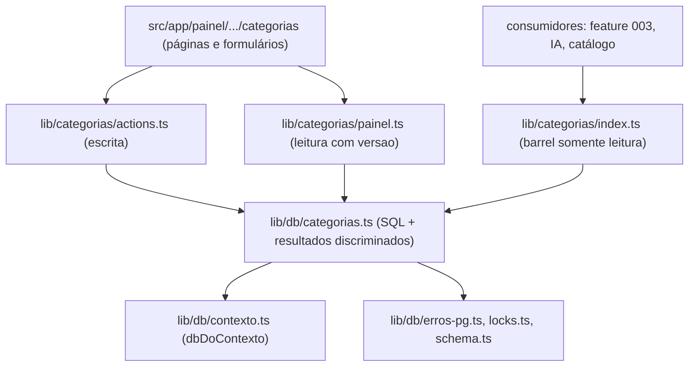
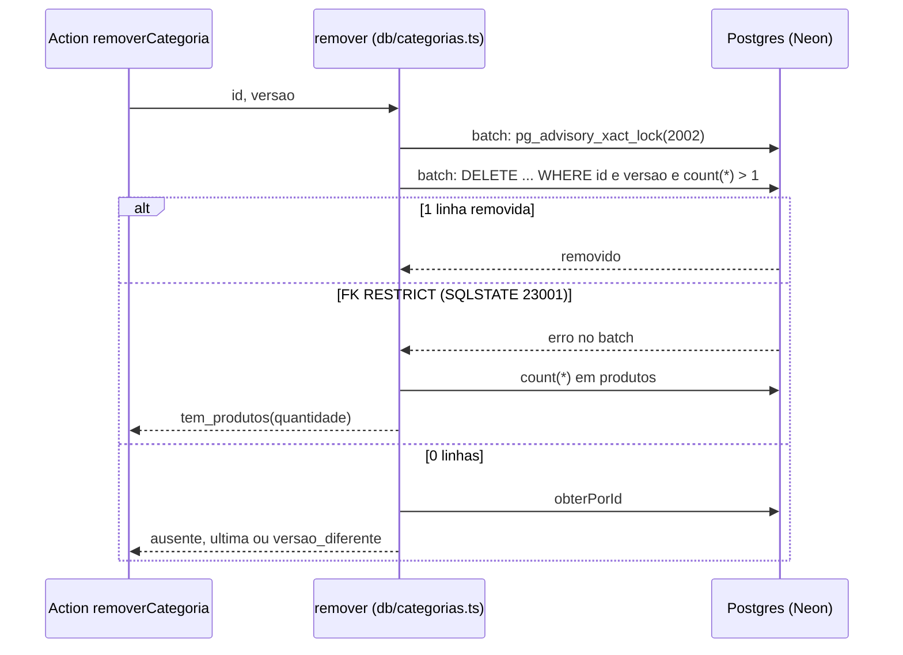

# F02 — Categorias de produtos

> Estado: **implementada** no branch `feature/002-categorias` (SF1 a SF6
> commitadas). Spec: [`specs/002-categorias/spec.md`](../../specs/002-categorias/spec.md);
> plano, contrato (`contracts/categorias.md`) e roteiro de validação
> (`quickstart.md`) na mesma pasta; decisões em
> [`specs/adr/008-integridade-de-dados-neon-http.md`](../../specs/adr/008-integridade-de-dados-neon-http.md).
> Ainda não há produtos: a regra "categoria com produtos não pode ser removida"
> só fica completa com a feature 003 (ver
> [database.md](../database.md#aviso-para-a-feature-003-fk-de-produtos)).

## Visão leiga

As categorias são as "prateleiras" da loja: Bolsas, Guarda-chuvas, Meias, Panos
de prato e Tupperware já vêm prontas. No painel, em **Categorias**, a
administradora vê a lista em ordem alfabética e pode:

- **Criar** uma categoria nova ("Nova categoria").
- **Renomear** uma existente.
- **Remover** uma categoria, numa tela de confirmação que avisa que não dá para
  desfazer.

O sistema recusa, com mensagem em português:

- nome vazio, com menos de 2 ou mais de 40 letras, ou com símbolos (só letras,
  números, espaço e hífen);
- nome que já existe, ainda que escrito diferente ("panos de prato",
  "GUÁRDA-chuvas" ou " Meias " contam como repetidos; "Guarda-chuva" no singular
  não);
- remover a **última** categoria (a loja precisa de pelo menos uma);
- remover categoria que tem produtos (vale quando a feature 003 existir);
- salvar uma categoria que **outra pessoa alterou** enquanto a tela estava
  aberta: pede para atualizar a lista e tentar de novo.

O texto digitado permanece no campo quando há erro. Só administradoras entram
(ver [F01](./F01-autenticacao.md)).

## Aprofundamento técnico

### Rotas e actions

Todas dentro de `src/app/painel/(protegido)/categorias/`; cada `page.tsx` chama
`requireAdminPage(<rota>)` antes de ler dados.

| Rota | Arquivo | O que faz |
|---|---|---|
| `/painel/categorias` | `page.tsx` | Lista (`listarCategoriasDoPainel`) com links "Nova categoria", "Renomear" e "Remover" por item. Alcançada pelo botão "Categorias" de `/painel`. |
| `/painel/categorias/nova` | `nova/page.tsx` + `form-criar.tsx` | Formulário cliente; chama a action `criarCategoria({ nome })` e volta para a lista. |
| `/painel/categorias/[id]/renomear` | `[id]/renomear/page.tsx` + `form-renomear.tsx` | Lê a categoria por `obterCategoriaDoPainel(id)` (id vem como string da URL); formulário envia `{ id, versao, nome }` a `renomearCategoria`. Id inválido ou inexistente mostra "Esta categoria não existe mais" com link para a lista. |
| `/painel/categorias/[id]/remover` | `[id]/remover/page.tsx` + `confirmar-remocao.tsx` | Tela de confirmação com o nome; "Remover" chama `removerCategoria({ id, versao })`, "Cancelar" volta à lista. |

| Server Action (`src/lib/categorias/actions.ts`) | Entrada | Resultado |
|---|---|---|
| `criarCategoria` | `{ nome }` | `{ ok: true }` ou `{ ok: false, motivo, mensagem, campo? }` |
| `renomearCategoria` | `{ id, versao, nome }` | idem |
| `removerCategoria` | `{ id, versao }` | idem (a confirmação é da tela, não da action) |

Ordem fixa em cada action: `requireAdminAction()` → validação (Zod) → banco →
`revalidatePath("/painel/categorias")`. Sem sessão, `UnauthorizedError`
propaga. Qualquer exceção do banco vira `falha_geral`: texto, host e usuário do
banco nunca chegam à tela (`traduzirExcecao` em `erros.ts`).

### Camadas e fronteira de acesso

| Arquivo | Papel |
|---|---|
| `src/lib/categorias/index.ts` | **Barrel somente leitura**, única porta para a 003, a IA e o catálogo: `listarCategorias`, `obterCategoria`, `exigirCategoriaValida` (nunca cria; rejeita com `CategoriaInvalidaError`), tipo `Categoria` (`{ id, nome }`, sem `versao`). Consumidores guardam só o `id`. |
| `src/lib/categorias/painel.ts` | Leitura do painel, inclui `versao` (só para formulários). Fora do barrel. |
| `src/lib/categorias/actions.ts` | As três Server Actions (`"use server"`). |
| `src/lib/categorias/nome.ts` | Validação de domínio (Zod): `validarNome` (normaliza NFC/trim/espaços; motivos `nome_vazio`, `nome_caracteres`, `nome_sem_letra`, `nome_tamanho`) e o schema rígido `idCategoria`/`versaoCategoria` (inteiro positivo até 2147483647 ou string decimal canônica; barra `" 3"`, `"1e2"`, `"03"`). Sem dependência de banco. |
| `src/lib/categorias/erros.ts` | `CategoriaInvalidaError` e a tradução resultado/exceção da camada db para `Falha` (`motivo`, `mensagem`, `campo?`). |
| `src/lib/categorias/mensagens.ts` | Todos os textos pt-BR mostrados às administradoras. |
| `src/lib/db/categorias.ts` | Camada SQL: `listar`, `obterPorId`, `inserir`, `renomear`, `remover`, `contarProdutosDaCategoria`. Devolve resultados discriminados (`ok`, `nome_repetido`, `ausente`, `versao_diferente`, `ultima`, `tem_produtos`); não conhece mensagens. |
| `src/lib/db/contexto.ts` | `dbDoContexto()`: `createDb` com `DATABASE_URL` e `NEON_FETCH_ENDPOINT` de `getCloudflareContext({ async: true })`. Os testes de integração a substituem por `createDb(process.env)` com `vi.mock`. |
| `src/lib/db/locks.ts` | Registro único das chaves de lock advisory (ADR-008). |
| `src/lib/db/erros-pg.ts` | `codigoSqlstate(erro)`: lê o SQLSTATE em `error.cause.code` (statement isolado) ou em `error.code` somente se for instância real de `NeonDbError` (dentro do `db.batch`). |
| `src/test/db/categorias-fixtures.ts` | Infra de teste (não é produção): `resetCategorias` (TRUNCATE + seed lido da migration), `criarFixtureProdutos`/`descartarFixtureProdutos` (tabela `produtos` provisória). |

A fronteira é imposta em **duas camadas**: ESLint (`no-restricted-imports` em
`eslint.config.mjs`) e o teste `src/test/conformance/categorias-acesso.test.ts`
(AST, nega por padrão, varre `src/**`): `@/lib/db/categorias` só em
`src/lib/categorias/` e `src/lib/db/`; o schema `categorias` só nesses dois;
`@/lib/categorias/actions` só em `src/app/painel/`; `painel.ts` só em
`src/app/painel/` e `src/lib/categorias/`; o barrel só exporta a allowlist de
leitura. O irmão `src/test/conformance/categorias-guard.test.ts` exige guard
(`requireAdminPage`/`requireAdminAction`) nas quatro páginas e nas três actions.

### Fluxo de remoção (o ponto mais delicado)

O driver é `neon-http` (sem `db.transaction()`; ver
[database.md](../database.md#regras-de-exclusão-e-integridade)). Para garantir
"sempre pelo menos uma categoria" mesmo com duas remoções simultâneas,
`remover` envia um `db.batch` (uma transação) com lock advisory:

O lock serializa remoções concorrentes; como cada statement do batch toma
snapshot novo em `READ COMMITTED`, o `DELETE` enxerga o commit da outra remoção.
Criar e renomear não usam lock: a unicidade é do `UNIQUE(chave)` (SQLSTATE
`23505`) e a edição simultânea é barrada pela `versao` no `WHERE`.

### Pegadinhas e decisões

- **SQLSTATE `23001`, não `23503`**: o bloqueio por produtos só é reconhecido por
  `23001` (FK `ON DELETE RESTRICT`). O padrão `NO ACTION` gera `23503` e não é
  tratado. A FK da 003 **precisa** declarar `RESTRICT` explicitamente (aviso em
  [database.md](../database.md#aviso-para-a-feature-003-fk-de-produtos)).
- **Forma do erro difere no `db.batch`** (ADR-008, Fato 1): no batch o
  `NeonDbError` chega sem embrulho (`error.code`); em statement isolado vem
  dentro de `DrizzleQueryError` (`error.cause.code`). Use sempre
  `codigoSqlstate`, nunca ler `.code` na mão.
- **`remover` contorna-se por SQL manual**: a regra do mínimo de 1 é da
  aplicação (ADR-008, consequências). Não faça `DELETE` direto em `categorias`
  no console do Neon.
- **`contarProdutosDaCategoria` usa SQL cru** (`FROM produtos`) porque a tabela
  ainda não está no schema; só roda após o `23001`. A 003 deve trocá-lo pelo
  schema Drizzle.
- **Testes de integração não rodam em paralelo**: `fileParallelism: false` em
  `vitest.int.config.mts`, porque vários arquivos fazem `TRUNCATE categorias`.
  Detalhes e a recuperação de fixture sobrada em
  [operacao.md, "Testes"](../operacao.md#testes-vitest).
- **Probe do `db.batch` no Neon dev** (`src/lib/db/batch-transacao.int.test.ts`,
  rodado por `vitest.probe.config.mts` no CI do PR): prova mesmo `txid_current`
  no batch, lock visível em `pg_locks` bloqueando o segundo batch, isolamento
  `read committed` e a forma do erro `23001` sem usar tabela. Não escreve em
  tabelas. Ver [operacao.md, "CI"](../operacao.md#ci).
- **Seed na migration, uma vez só**: remover ou renomear uma categoria inicial é
  permanente; migrate e novos deploys não a recriam.
- **`sessao` é parâmetro ainda sem uso** nas funções de escrita de
  `src/lib/db/categorias.ts` (por contrato; não há auditoria nesta feature).
- **SC-002 (toques/tempo no celular) e SC-007** são validações manuais/adiadas,
  anotadas no PR, não automatizadas.
