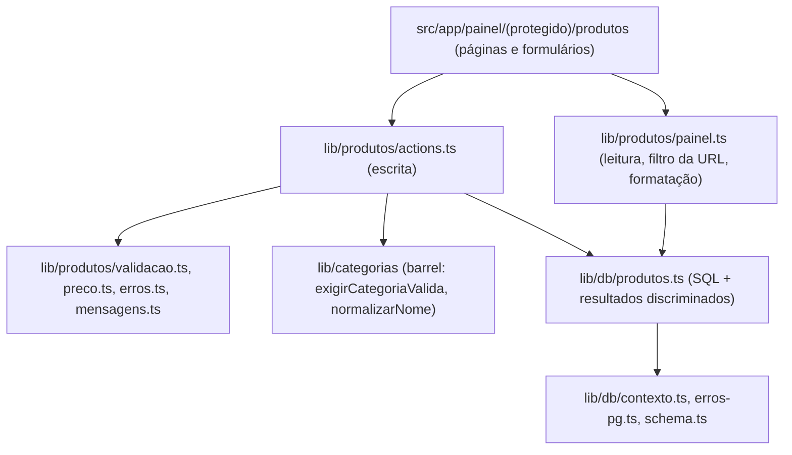
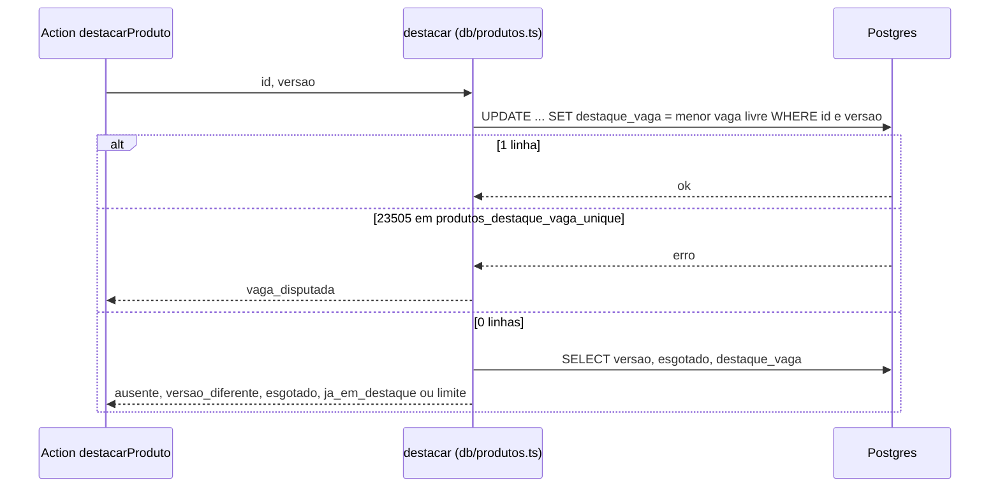

# F03 — Produtos

> Estado: **implementada** no branch `feature/003-produtos` (SF1 a SF8b
> commitadas; SF9, fechamento com preview, mensagens e docs, em curso). Spec:
> [`specs/003-produtos/spec.md`](../../specs/003-produtos/spec.md); plano,
> contrato (`contracts/produtos.md`), modelo (`data-model.md`), `research.md` e
> a matriz critério → teste (`rastreabilidade.md`) na mesma pasta. Decisões de
> integridade em
> [`specs/adr/008-integridade-de-dados-neon-http.md`](../../specs/adr/008-integridade-de-dados-neon-http.md).
> **Fotos ainda não existem** (feature 004): as telas mostram o quadro "sem foto"
> e a tabela `produto_fotos` é só modelo.

## Visão leiga

Produtos são os itens da loja (uma bolsa, um pacote de meias). No painel, em
**Produtos**, a administradora vê a lista dos mais novos para os mais antigos e
pode:

- **Cadastrar** um produto: nome, categoria, descrição (opcional) e preço
  (opcional). Cada produto ganha um **código de referência** (`#0042`), que é o
  número interno com zeros à esquerda.
- **Filtrar** por categoria e por situação (disponível ou esgotado) e **buscar**
  por parte do nome ou pelo código. Acentos, maiúsculas e hífen não importam.
- Abrir o **detalhe**, **editar** e **remover** (tela de confirmação).
- Marcar **esgotado** ou **disponível** de novo.
- Colocar em **destaque** (vitrine) até **8 produtos**; esgotado nunca fica em
  destaque.

Preço aceita "12,90", "1.290,00", "12.90" e "R$ 12". Com a opção "a partir de"
ele aparece como "a partir de R$ 12,90". Sem preço, a lista mostra "Sem preço".

O sistema recusa, com mensagem em português: nome vazio ou fora de 3 a 80
letras; nome que já existe (mesma regra das categorias, e a mensagem cita o
código do produto existente); categoria que sumiu enquanto o formulário estava
aberto; preço ambíguo ("1.290" ou "12 90") ou inválido; "a partir de" sem preço;
um 9º destaque; destacar produto esgotado; e salvar um produto que **outra
pessoa alterou** no meio (pede para recarregar). O que foi digitado permanece
no formulário em caso de erro. Só administradoras entram
(ver [F01](./F01-autenticacao.md)).

## Aprofundamento técnico

### Rotas e actions

Telas em `src/app/painel/(protegido)/produtos/`; cada `page.tsx` chama
`requireAdminPage(<rota>)` antes de ler dados. Alcançada pelo botão "Produtos" de
`/painel` (`src/app/painel/(protegido)/page.tsx`).

| Rota | Arquivo | O que faz |
|---|---|---|
| `/painel/produtos` | `page.tsx` | Lista de 20 em 20 com filtros (`categoria`, `situacao`, `busca`) por GET, "Ver mais produtos" (cursor `antes`) e "Voltar ao começo". Aviso de sucesso/erro vem de `?aviso=`. |
| `/painel/produtos/novo` | `novo/page.tsx` + `form-produto.tsx` | Formulário de cadastro (`criarProduto`); ao salvar, vai para o detalhe. |
| `/painel/produtos/[id]` | `[id]/page.tsx` + `acoes-produto.tsx` | Detalhe com botões esgotar/disponibilizar e destacar/tirar do destaque, links Editar e Remover, autoria. Id inexistente mostra "Produto não encontrado". |
| `/painel/produtos/[id]/editar` | `[id]/editar/page.tsx` + `form-produto.tsx` | Mesmo formulário em modo `edicao`, com `id` e `versao`. O preço entra em centavos e a máscara formata. |
| `/painel/produtos/[id]/remover` | `[id]/remover/page.tsx` + `confirmar-remocao.tsx` | Confirmação com código e nome; "Remover" chama `removerProduto`. |

| Server Action (`src/lib/produtos/actions.ts`) | Entrada (FormData) | Resultado |
|---|---|---|
| `criarProduto` | `nome`, `categoriaId`, `descricao`, `preco`, `aPartirDe` | `{ ok: true, id }` ou falha |
| `editarProduto` | idem + `id`, `versao` | `{ ok: true, id, versao }` (versão nova) ou falha |
| `marcarEsgotado` | `id`, `versao` | `{ ok: true, saiuDoDestaque }` ou falha |
| `marcarDisponivel`, `destacarProduto`, `tirarProdutoDoDestaque`, `removerProduto` | `id`, `versao` | `{ ok: true }` ou falha |

Falha é `{ ok: false, motivo, mensagem, campo?, codigoExistente?, valores? }`;
`valores` devolve o digitado para reidratar o formulário. Ordem fixa nas
actions: `requireAdminAction()` → validação (`validarCamposProduto`) →
`exigirCategoriaValida` (cadastro/edição) → banco → `revalidatePath` da lista e
do detalhe. Exceção do banco vira `falha_geral`: texto do banco nunca chega à
tela. A action **nunca redireciona**; o destino de um sucesso é da UI. Se a
action rejeitar (sessão expirada), `comFalhaGeral`
(`produtos/com-falha-geral.ts`) mostra a mensagem geral e preserva os valores.

### Camadas e arquivos

| Arquivo | Papel |
|---|---|
| `src/lib/db/schema.ts` | Tabelas `produtos` e `produto_fotos` (ver [database.md](../database.md#tabela-produtos)). |
| `src/lib/db/migrations/0001_premium_boomerang.sql` | Cria as duas tabelas, FKs e índices. |
| `src/lib/db/produtos.ts` | Camada SQL: `inserir`, `editar`, `remover`, `esgotar`, `disponibilizar`, `tirarDoDestaque`, `destacar`, `obterPorId`, `listar`. Um statement por operação; devolve resultados discriminados (`ok`, `nome_repetido`, `categoria_ausente`, `ausente`, `versao_diferente`, `limite`, `vaga_disputada`, `esgotado`, `ja_em_destaque`). Não conhece mensagens. |
| `src/lib/produtos/actions.ts` | As Server Actions (`"use server"`). |
| `src/lib/produtos/painel.ts` | Leitura do painel (`server-only`): valida a query da URL com Zod (valor ruim é ignorado, nunca erro), monta `ItemLista`/`DetalheProduto`, preço formatado, links de paginação e `voltar` seguro. |
| `src/lib/produtos/validacao.ts` | Porta única de validação dos campos (`validarCamposProduto`, modos `cadastro`/`edicao`); reusa `normalizarNome` do barrel de categorias. |
| `src/lib/produtos/preco.ts` | `parsePreco` (texto → centavos, sem float; `preco_invalido`/`preco_ambiguo`), `formatarPreco`, `formatarAPartirDe`. |
| `src/lib/produtos/codigo.ts` | `formatarCodigo(id)` (`#0042`) e `interpretarCodigoBusca`. |
| `src/lib/produtos/erros.ts`, `mensagens.ts` | Tradução resultado → `Falha` e todos os textos pt-BR. |
| `src/components/ui/` | Primitivos novos de formulário: `campo-texto`, `area-texto`, `selecao`, `caixa-marcacao`, `mensagem-campo`, `aviso`. |
| `src/test/db/produtos-fixtures.ts` | Infra de teste (não é produção): `inserirProduto(s)`, `limparProdutos`. |

### Concorrência, destaque e status

O driver é `neon-http` (sem `db.transaction()`; ver
[database.md](../database.md#regras-de-exclusão-e-integridade)). Cada operação
de escrita é **um único statement**, sem lock advisory:

- **Edição simultânea**: todo `UPDATE`/`DELETE` leva `AND versao = $versao` e o
  `UPDATE` soma 1. Zero linhas ⇒ uma leitura só escolhe a mensagem (`ausente` ou
  `versao_diferente`). Premissa documentada no código: **todo writer de
  `produtos` incrementa `versao`**.
- **Nome repetido**: `UNIQUE(chave)` (SQLSTATE `23505`); o código então busca o
  produto existente por `chave = categoria_chave($1)` para citar o código na
  mensagem (sem código se a linha sumiu no meio).
- **Teto de 8 destaques**: `destacar` escolhe a menor vaga livre de 1 a 8 no
  próprio `UPDATE` (`generate_series` + `NOT EXISTS`). Sem vaga ⇒ 0 linhas ⇒
  leitura decide a mensagem, nesta precedência: ausente, versão diferente,
  esgotado, já em destaque, limite. Duas pessoas pegando a mesma vaga: o índice
  único parcial faz a segunda falhar com `23505` na constraint
  `produtos_destaque_vaga_unique` ⇒ `vaga_disputada`. Outro `23505` propaga.
- **Esgotar tira do destaque**: `esgotar` zera `destaque_vaga` no mesmo
  `UPDATE`; uma CTE `antes` informa `saiuDoDestaque`. Voltar a disponível
  **não** recoloca no destaque.
- **FK da categoria**: `23503` ao inserir/editar vira `categoria_ausente`. A
  remoção de categoria com produtos é barrada pela FK `ON DELETE RESTRICT`
  (ver [F02](./F02-categorias.md#pegadinhas-e-decisões)).

### Lista, busca e paginação

`listar` ordena por `id DESC` com **cursor keyset** (`id < antes`), então
cadastro ou remoção entre páginas não repete nem pula item. Busca: texto casa
`strpos(chave, categoria_chave(texto)) > 0` (mesma regra da unicidade), e texto
que parece código (`^#?\d{1,9}$`) também casa `id` por `OR`. Busca só com
símbolos/hífen (chave vazia) é ignorada. A página de detalhe recebe
`?voltar=<query da lista>`, sempre reconstruída pelo schema e apontando para o
caminho fixo `/painel/produtos` (sem redirecionamento aberto).

### Fronteira de acesso e guards

Teste de conformidade `src/test/conformance/produtos-acesso.test.ts` (AST, nega
por padrão, varre `src/**`): o SQL de produtos, o schema e os módulos
`actions`/`painel` só são importados pelas camadas permitidas (exceções
explícitas por arquivo, só em testes). `produtos-paginas-guard.test.ts` exige
`requireAdminPage` importado do barrel de auth em toda `page.tsx` de produtos;
`painel-guard.test.ts` cobre as actions. `categorias-acesso.test.ts` passou a permitir que o barrel de categorias exporte
`normalizarNome` (reusado pela validação de produtos).

### Pegadinhas e decisões

- **`produtos.id` é o código de referência**: não há coluna separada; o
  formato `#0042` é só apresentação (`formatarCodigo`).
- **`aPartirDe` sem preço**: no cadastro é erro (`a_partir_de_sem_preco`); na
  edição o domínio e o SQL o zeram silenciosamente (apagar o preço desmarca).
- **FK da 003 provada no Neon dev**: `src/lib/db/fk-produtos.int.test.ts` (FK
  `RESTRICT` ⇒ `23001` dentro de um `db.batch` que reverte tudo) roda no proxy
  local **e no Neon dev pelo CI do PR** (`vitest.probe.config.mts`). Não usa
  `TRUNCATE`: toda linha leva um marcador único no nome e a limpeza apaga só por
  ele.
- **Medição de desempenho**: `npm run test:perf`
  (`vitest.perf.config.mts` → `src/test/db/produtos-medicao.int.test.ts`) popula
  500 produtos no banco **local**, mede `listar` (meta < 2 s por consulta) e
  limpa. Fica fora do `check` e do `test:int` (exclusão em
  `vitest.int.config.mts`); como usa `resetCategorias`, **recria as categorias**
  do banco local. A medição no `preview` (SC-007) é da SF9.
- **Sem foto**: `DetalheProduto.fotos` é sempre `[]` e `produto_fotos` não é
  gravada por nenhum código até a feature 004.
- **`criadoPor`/`atualizadoPor` guardam o e-mail da sessão**, exibido no
  detalhe ("Cadastrado por …").
- **Testes de integração de produtos** usam nomes únicos por processo
  (`nomeUnicoProduto`), pois `chave` tem unicidade global.
