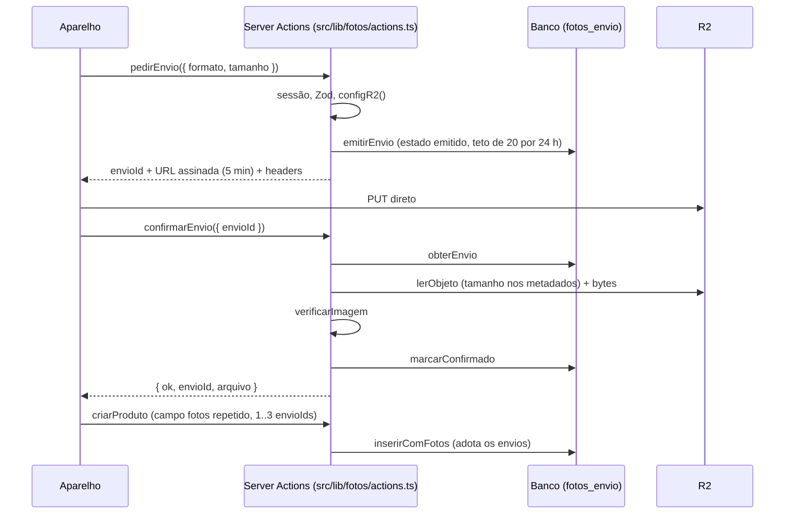
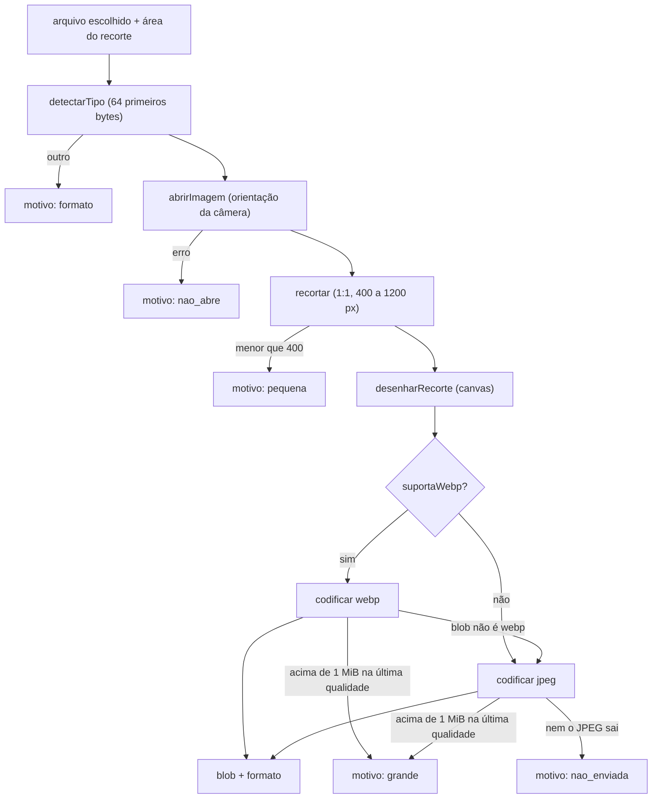

# F04 — Fotos de produto

> Estado: **em andamento** no branch `feature/004-fotos-produto`. Construído até a
> SF8: schema (SF1), verificação do arquivo (SF2), módulo R2 (SF3), SQL de envios
> e do cadastro com fotos (SF4/SF5), as Server Actions de envio, a rota de
> exibição e a exigência de fotos no cadastro (SF6), as actions do conjunto
> (adicionar, trocar, remover, mover: SF7) e o pipeline de tratamento da foto no
> aparelho (SF8, ainda sem tela que o chame). **Ainda não existem**: a UI de fotos
> (SF9 e SF11), IA e limpeza diária (cron). Spec:
> [`specs/004-fotos-produto/spec.md`](../../specs/004-fotos-produto/spec.md);
> contrato em `contracts/fotos.md` e decisões no
> [ADR-009](../../specs/adr/009-fotos-r2.md).

## Visão leiga

Cada produto precisa de 1 a 3 fotos. Depois de cadastrado, o conjunto pode ser
alterado foto a foto: adicionar (até 3), trocar uma, remover (nunca a última) e
mudar a ordem (a foto da posição 1 é a capa). Essas operações já existem como
actions, mas ainda sem tela (SF11). A foto não passa pelo servidor do site: a
administradora escolhe a foto, o sistema pede uma **autorização de envio**
(`pedirEnvio`), o aparelho manda o arquivo direto ao armazenamento (R2) e o
sistema **confere** o que chegou (`confirmarEnvio`). Só então a foto fica
"confirmada" e pode ser usada no cadastro do produto. Fotos nunca são públicas: só
quem está logada no painel consegue vê-las.

Antes de enviar, o próprio aparelho **prepara** a foto: confere que é uma imagem de
verdade, endireita a orientação da câmera, recorta em quadrado, reduz se for grande
demais e regrava em WebP ou JPEG abaixo de 1 MB. Isso também descarta os metadados do
original (localização, câmera). Esse tratamento já existe como código
(`src/lib/fotos/aparelho/`, SF8), mas nenhuma tela o chama ainda (SF9).

> **Observação de UX (até a SF9)**: a tela de cadastro ainda não envia fotos.
> Criar um produto pela tela devolve "Coloque pelo menos 1 foto do produto.",
> porque `criarProduto` agora exige 1 a 3 fotos. O cadastro só funciona
> chamando as actions por código/teste até a SF9.

## Aprofundamento técnico

### Fluxo de uma foto



### Pipeline da foto no aparelho (`src/lib/fotos/aparelho/`, SF8)

Código **só de navegador**: sem `server-only`, `@/lib/r2`, `@/lib/db`, auth nem `next`.
O teste `src/lib/fotos/aparelho/fronteira.test.ts` lê os imports dos 5 arquivos e só
admite `./x` do próprio diretório e `mensagens`/`tipos` de `src/lib/fotos/`. As APIs do
navegador (`createImageBitmap`, canvas, teste de WebP) são **injetáveis**, por isso o
pipeline é testável em Node. Contrato: `specs/004-fotos-produto/contracts/telas.md` §3
(bloco "Decisões da SF8").



| Arquivo | Papel |
|---|---|
| `detectar-tipo.ts` | `detectarTipo`: JPEG, PNG, WebP ou HEIC pelos bytes (assinatura; HEIC pela caixa `ftyp`, e `mif1`/`msf1` só com marca HEIC compatível, para não aceitar AVIF); o resto é `outro`. Nome, extensão e MIME declarado não entram. `BYTES_CABECALHO = 64`. |
| `suporta-webp.ts` | `suportaWebp`: `toBlob` de um canvas 1×1 em `image/webp`; resultado guardado uma vez por sessão. Safari antigo devolve PNG, e isso conta como "não suporta". |
| `recortar.ts` | `recortar` (limita a área à imagem, lado final = `min(origem.lado, 1200)`, nunca amplia, origem < 400 = `pequena`) e `desenharRecorte` (canvas, suavização alta). `LADO_MINIMO = 400`, `LADO_MAXIMO = 1200`. |
| `codificar.ts` | `codificar`: WebP (0.82, 0.72, 0.62) ou JPEG (0.85, 0.72, 0.62), a primeira qualidade que cabe em `TETO_BYTES = 1_048_576`. |
| `preparar-foto.ts` | `abrirImagem` e `prepararFoto`, a única função que a tela chama. |

- **Saída**: `{ blob, formato: "webp" | "jpeg" }` ou `{ motivo }` com `formato`,
  `nao_abre`, `pequena`, `grande` ou `nao_enviada` (subconjunto de `MotivoFoto`). PNG e
  HEIC são aceitos só como **entrada**; o que sai é sempre WebP ou JPEG.
- **`prepararFoto` nunca rejeita**: falha fora do previsto (leitura do arquivo, contexto
  2d nulo, nem o JPEG sai, `suportaWebp` com erro) vira `{ motivo: "nao_enviada" }`. A
  tela só olha o `motivo`.
- **Conferência do `blob.type`**: o navegador pode devolver outro tipo em silêncio
  (Safari entrega PNG ao pedir WebP). Se o WebP vier errado, `codificar` recodifica em
  JPEG; se nem o JPEG vier certo, lança `FalhaCodificacao`, que `prepararFoto` converte
  em `nao_enviada`.
- **Memória**: a imagem aberta é fechada sempre (`close`) e o canvas é zerado
  (`width`/`height` = 0) ao fim, porque o Safari do iOS limita a memória de canvas.
- **Foto de entrada animada**: só o primeiro quadro é desenhado.
- O servidor **não confia** nesse tratamento: `confirmarEnvio` verifica o arquivo
  recebido de novo (`verificarImagem`).

### Actions de envio (`src/lib/fotos/actions.ts`)

Arquivo `"use server"`; chamadas programáticas (objeto, não `FormData`), nunca
redirecionam. Sem sessão, `UnauthorizedError` propaga (`requireAdminAction`). Falha
é `{ ok: false, motivo, mensagem, atual? }`.

| Action | Ordem dos passos | Resultado |
|---|---|---|
| `pedirEnvio` | guard → Zod (`formato` webp/jpeg, `tamanho` inteiro ≥ 1) → tamanho > 1 MiB = `grande` → `configR2()` **antes de gravar** (config ausente = `falha_geral` sem deixar linha contando no teto) → `emitirEnvio` (20 envios/24 h, senão `muitos_pendentes`) → `assinarEnvio`. Se a assinatura falhar, `descartarEnvio` em melhor esforço (log `fotos.envio.linha_nao_descartada`). | `{ ok: true, envioId, url, headers }` |
| `confirmarEnvio` | guard → Zod (`envioId` uuid) → `obterEnvio` (inexistente ou de outra pessoa = `falha_geral`) → já `confirmado` devolve ok (**idempotente**, sem reverificar) → `lerObjeto` (ausente = `nao_enviada`, **a linha fica**) → tamanho dos metadados ≠ declarado ou > 1 MiB = `grande` → `verificarImagem` → `marcarConfirmado`. 0 linhas no `marcarConfirmado`: relê; se outra confirmação ganhou, ok. | `{ ok: true, envioId, arquivo }` |

Pontos de projeto:

- **Recusa apaga a linha antes do objeto (TL-2)**: `recusar` chama `descartarEnvio`
  (só apaga `emitido`) e só então `apagarObjetos([chave])`. Uma confirmação
  concorrente que já marcou `confirmado` não perde o objeto. Falha ao apagar o
  objeto só gera log (`fotos.confirmacao.objeto_nao_apagado`); o órfão sai na
  limpeza diária (ainda não existe).
- **Modo registro** (`modoVerificacao()`): a verificação relaxa só o metadado e a
  action registra um `console.warn("fotos.verificacao.registro", ...)` com
  `envioId`, resultado, motivo, regra e blocos. **Nunca bytes.**
- Mapeamento do motivo da verificação para o da tela: `formato` → `formato`;
  `pequena` → `pequena`; `metadado`, `animada`, `corrompida`, `dimensao` →
  `nao_passou` (`src/lib/fotos/erros.ts`).

### Actions do conjunto (`src/lib/fotos/actions.ts`)

Quatro actions chamadas pela tela do produto já cadastrado (a tela é a SF11). Todas
passam por `alterarConjunto`, que fixa a ordem dos passos.

| Action | Entrada | Regra aplicada (`aplicarAcao`) |
|---|---|---|
| `adicionarFoto` | `produtoId`, `fotosVersao`, `envioId` | acrescenta no fim; com 3 fotos = `limite`; produto sem fotos (herdado da 003) aceita |
| `trocarFoto` | `produtoId`, `fotosVersao`, `posicao` (1..3), `envioId` | substitui a foto da posição; a chave antiga sai do conjunto |
| `removerFoto` | `produtoId`, `fotosVersao`, `posicao` | tira a foto; se for a única = `ultima`; a chave sai do conjunto |
| `moverFoto` | `produtoId`, `fotosVersao`, `de`, `para` | reposiciona; `de` = `para` = `falha_geral` |

Ordem em `alterarConjunto`:

```mermaid
sequenceDiagram
  participant A as Aparelho
  participant S as alterarConjunto
  participant D as Banco
  participant R as R2
  A->>S: adicionarFoto / trocarFoto / removerFoto / moverFoto
  S->>S: requireAdminAction, Zod (envioId uuid minúsculo com hífens)
  S->>D: lerConjunto (produto + fotosVersao + fotos)
  S->>S: fotosVersao diferente = alterado
  S->>D: obterEnvio (só adicionar e trocar; ausente ou não confirmado = foto_expirada)
  S->>S: aplicarAcao (regra pura, conjunto.ts)
  S->>D: substituirConjunto (db.batch sob LOCK_FOTOS)
  S->>S: revalidatePath /painel/produtos e /painel/produtos/id
  S->>R: apagarObjetos([chave que saiu]) (só trocar e remover)
  S-->>A: ok + fotosVersao nova + fotos
```

- **Regra pura** (`src/lib/fotos/conjunto.ts`, `aplicarAcao`, sem I/O): devolve a lista
  nova numerada de 1 a n, mais `saiu` (a chave que deixou o conjunto) em trocar e
  remover, ou uma recusa. `MAXIMO_FOTOS = 3`. Recusas: `limite`, `ultima`, e
  `falha_geral` para posição inexistente, `de` = `para` ou chave repetida (a mesma
  foto já presente no conjunto). O resultado sempre tem 1 a 3 fotos em posições 1..n.
- **Zod**: `produtoId` inteiro positivo, `fotosVersao` inteiro ≥ 0, posições inteiras
  1..3, `envioId` via `uuidEnvio`. Entrada inválida = `falha_geral` sem tocar no banco
  e **sem `atual`**.
- **Chave e autoria vêm do banco, não do cliente**: a chave nova, `enviadoPor` e
  `enviadoEm` (= `criadoEm` do envio) saem do envio lido por `obterEnvio` com a sessão.
  Envio inexistente, de outra pessoa ou não `confirmado` = `foto_expirada`. A validade de
  24 h é conferida no batch (`substituirConjunto`).
- **Resposta de sucesso**: `{ ok: true } & Conjunto` (`fotosVersao` nova + `fotos`), **sem
  `mensagem`**: a tela usa `SUCESSO_FOTO` (`src/lib/fotos/mensagens.ts`). A vista é
  montada antes do batch, então um erro nela vira `falha_geral` sem gravar nada.
- **Falhas trazem `atual`** (conjunto e `fotosVersao` correntes) sempre que o conjunto
  pôde ser lido: `alterado`, `foto_expirada`, `limite`, `ultima` e `falha_geral` da
  regra. Se o batch devolve `alterado` ou `foto_expirada`, o conjunto é **relido**
  (`falharRelendo`). Sem `atual` só em: entrada inválida, `nao_existe` (produto sumido,
  inclusive no batch) e falha da primeira leitura.
- **R2 depois do batch, em melhor esforço**: trocar e remover apagam o objeto antigo
  só depois de o banco valer; `revalidatePath` também. Falha ao apagar não vira erro:
  só `console.warn("fotos.conjunto.objeto_nao_apagado", { produtoId })`, sem chave. O
  órfão sai na limpeza diária (ainda não existe).
- **Versão própria**: o conjunto usa `fotosVersao` (concorrência otimista), separada da
  `versao` do produto.

### Rota de exibição

| Rota | Handler | O que faz |
|---|---|---|
| `GET /painel/fotos/[arquivo]` | `src/app/painel/fotos/[arquivo]/route.ts` | Serve a imagem do R2 ao painel. |

Ordem: `getAdminSession` (sem sessão, **404**, não lança nem redireciona) → regex
`chaveDoArquivo` (`<uuid v4>.(webp|jpg)`) **antes** de tocar no binding →
`fotoExibivel` → `servirObjeto(chave, If-None-Match)`. Qualquer recusa é um 404
igual. Só a chave que está em `produto_fotos` ou em `fotos_envio` `confirmado` é
servida (`chaveExibivel` em `src/lib/db/fotos.ts`, um statement). Resposta 200 com
`Cache-Control: private, max-age=31536000, immutable`, `ETag`, `X-Content-Type-Options:
nosniff` e `Content-Security-Policy: default-src 'none'`; se o `If-None-Match` casa, o
R2 devolve o objeto sem corpo e a rota responde **304**. Exceção em qualquer passo:
500 sem corpo e `console.error("fotos.exibicao.falha")`, sem chave, arquivo nem erro
original. Só `GET` é exportado (o Next atende `HEAD` com o mesmo handler).

### Cadastro de produto com fotos

`criarProduto` (`src/lib/produtos/actions.ts`) lê o campo `fotos` repetido do
`FormData`, na ordem: nenhum = `sem_foto`; fora de 1..3 ids distintos (uuid) =
`falha_geral` (adulteração). Depois chama `inserirComFotos` (`src/lib/db/produtos.ts`,
substituiu o `inserir` da 003). Se algum envio não é mais válido (da pessoa,
`confirmado`, com menos de 24 h), a falha é `foto_expirada` com `envioIds` dos
envios a refazer; lista vazia (corrida) vira `falha_geral`. Mensagens em
`src/lib/produtos/mensagens.ts` e `src/lib/fotos/mensagens.ts` (os textos
repetidos têm teste de igualdade).

`removerProduto` agora usa `remover`, que devolve `{ tipo: "removido", chaves }`;
a action apaga os objetos no R2 **depois do banco**, em melhor esforço (log
`produtos.remocao.objetos_nao_apagados` só com a quantidade). Falha do R2 não
desfaz a remoção.

### Arquivos

| Arquivo | Papel |
|---|---|
| `src/lib/fotos/actions.ts` | `pedirEnvio`, `confirmarEnvio` e as do conjunto: `adicionarFoto`, `trocarFoto`, `removerFoto`, `moverFoto` (via `alterarConjunto`). |
| `src/lib/fotos/aparelho/` | Pipeline da foto no navegador (SF8): `detectar-tipo.ts`, `suporta-webp.ts`, `recortar.ts`, `codificar.ts`, `preparar-foto.ts` e o teste de fronteira; ver a seção acima. |
| `src/lib/fotos/conjunto.ts` | `aplicarAcao` (regra pura do conjunto), `MAXIMO_FOTOS`, tipos `AcaoConjunto` e `NovaFoto`. |
| `src/lib/fotos/tipos.ts` | `MotivoFoto`, `FotoVista`, `Conjunto`, `FalhaFoto`, `ResultadoFotos`; sem imports de runtime (seguro para o client). |
| `src/lib/fotos/mensagens.ts` | Textos pt-BR por motivo, avisos de sucesso e confirmação; sem imports de runtime. |
| `src/lib/fotos/erros.ts` | `falhaFoto` e o mapa motivo da verificação → motivo da tela. |
| `src/lib/fotos/validacao.ts` | `uuidEnvio` (normaliza para minúsculas) e `envioIdsCadastro` (1..3 distintos). |
| `src/lib/fotos/exibicao.ts` | `fotoExibivel` (`server-only`): a rota não importa `db/fotos` direto. |
| `src/lib/db/fotos.ts` | SQL: `emitirEnvio`, `obterEnvio`, `marcarConfirmado`, `descartarEnvio`, `enviosValidos`, `chaveExibivel`, `lerConjunto`, `substituirConjunto`; `TETO_PENDENTES = 20`; `envioValido` (a regra `VALIDO`). |
| `src/lib/db/produtos.ts` | `inserirComFotos`, `remover` (devolve as chaves), `obterPorId` (traz `fotosVersao` e `fotos`) e `listar` (traz `capa`, a posição 1). |
| `src/lib/r2/` | Módulo R2, ver [architecture.md](../architecture.md#módulo-r2-feature-004-sf2-sf3-e-sf6); `servirObjeto` foi acrescentado na SF6. |
| `src/test/db/fotos-fixtures.ts` | Infra de teste (não é produção). |

### Concorrência e travas

Os writers que tocam fotos são `db.batch` sob `LOCK_FOTOS` (4001), a emenda de
2026-10-09 do ADR-008: `inserirComFotos`, `remover` e `substituirConjunto`. Emitir,
confirmar e descartar envio são um statement cada, fora do lock. Todo array vai como
**um** parâmetro (`${sql.param(ids)}::uuid[]`). `substituirConjunto`/`lerConjunto`
(conjunto de fotos de um produto, com `fotos_versao` própria, sem tocar `versao`)
são chamados pelas actions do conjunto (SF7). Detalhes do schema em
[database.md](../database.md#tabela-fotos_envio).

### Fronteira de acesso e guards

- **ESLint** (`eslint.config.mjs`, `proibirSubmoduloR2`): proíbe importar
  `@/lib/r2/*` (submódulos) fora de `src/lib/r2/`; só o barrel `@/lib/r2`, que tem
  `server-only`. Vale em `src/app`, `src/lib/categorias`, `src/lib/db` etc.
- **`src/test/conformance/fotos-acesso.test.ts`**: AST, nega por padrão; confere as regras
  de import do contrato §1 (R2 só em áreas autorizadas, submódulo de R2 fora de
  `src/lib/r2/`, `db/fotos` só em `fotos/`, `produtos/` e `db/`, aparelho sem
  `server-only`/db/r2/auth, `aws4fetch` só no R2) e a regra 6: `INSERT` em `produtos` só
  dentro de `inserirComFotos`.
- **`src/test/conformance/fotos-rota-guard.test.ts`**: prova a ordem da rota (sessão
  antes do R2, regex antes do binding).
- **`painel-guard.test.ts`**: a rota de imagem é a exceção nomeada
  `GUARDA_POR_SESSAO` (`src/app/painel/fotos/[arquivo]/route.ts#GET`): exige
  `getAdminSession` em vez de `requireAdminAction`, porque sem sessão responde 404 e
  não lança.

### Pegadinhas

- **Criar produto pela tela falha até a SF9** (ver a observação no topo).
- **Pipeline do aparelho sem tela**: `prepararFoto` só é exercido por teste até a SF9
  (telas do cadastro, com `react-easy-crop` para a área do recorte).
- **Actions do conjunto sem UI**: `adicionarFoto`, `trocarFoto`, `removerFoto` e
  `moverFoto` só são exercidas por teste até a SF11.
- **`pedirEnvio` valida a config do R2 antes de gravar**: sem
  `R2_ACCESS_KEY_ID`/`R2_SECRET_ACCESS_KEY`/`R2_S3_ENDPOINT` a resposta é
  `falha_geral` e nenhuma linha `emitido` é criada.
- **Teto de pendentes é aproximado** sob concorrência da mesma pessoa (comentário em
  `TETO_PENDENTES`).
- **`foto_expirada` por 24 h**: o envio só vale se `confirmado` e com menos de 24 h; o
  id é normalizado para minúsculas (o Postgres devolve assim).
- **Objetos órfãos** (recusa que não apagou o objeto, troca/remoção de foto ou de produto com R2
  fora) dependem da limpeza diária, que ainda não existe (dívida da feature).
- **Valide no `preview`**: o binding do R2 e o endpoint S3 local só existem no
  worker, nunca no `next dev`.
