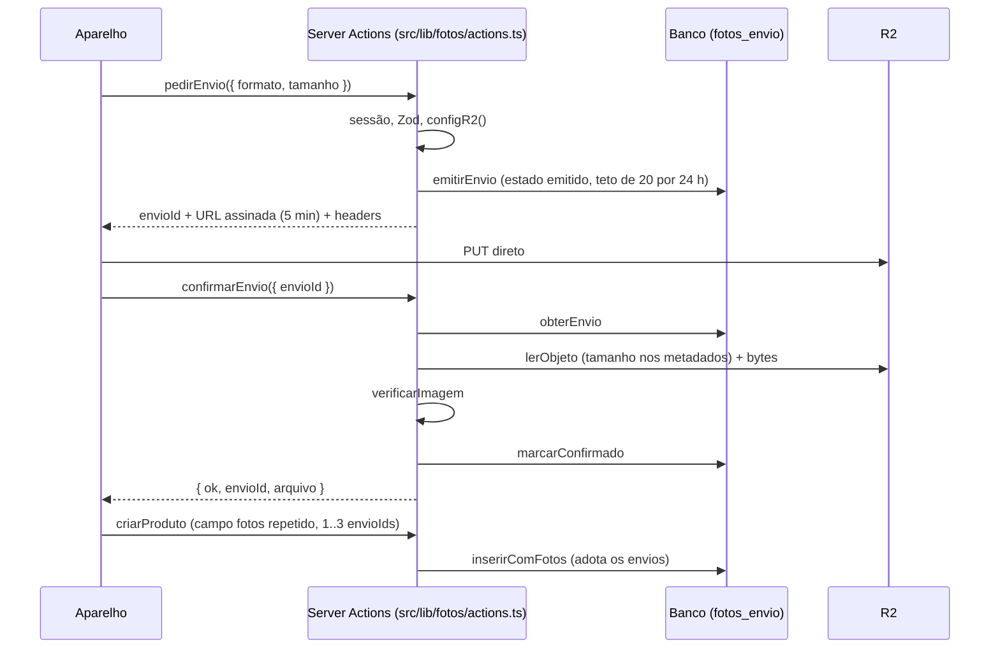

# F04 — Fotos de produto

> Estado: **em andamento** no branch `feature/004-fotos-produto`. Construído até a
> SF6: schema (SF1), verificação do arquivo (SF2), módulo R2 (SF3), SQL de envios
> e do cadastro com fotos (SF4/SF5) e as Server Actions de envio, a rota de
> exibição e a exigência de fotos no cadastro (SF6). **Ainda não existem**: UI de
> fotos (SF9), actions do conjunto (adicionar, trocar, remover, mover: SF7), IA e
> limpeza diária (cron). Spec:
> [`specs/004-fotos-produto/spec.md`](../../specs/004-fotos-produto/spec.md);
> contrato em `contracts/fotos.md` e decisões no
> [ADR-009](../../specs/adr/009-fotos-r2.md).

## Visão leiga

Cada produto precisa de 1 a 3 fotos. A foto não passa pelo servidor do site: a
administradora escolhe a foto, o sistema pede uma **autorização de envio**
(`pedirEnvio`), o aparelho manda o arquivo direto ao armazenamento (R2) e o
sistema **confere** o que chegou (`confirmarEnvio`). Só então a foto fica
"confirmada" e pode ser usada no cadastro do produto. Fotos nunca são públicas: só
quem está logada no painel consegue vê-las.

> **Observação de UX (até a SF9)**: a tela de cadastro ainda não envia fotos.
> Criar um produto pela tela devolve "Coloque pelo menos 1 foto do produto.",
> porque `criarProduto` agora exige 1 a 3 fotos. O cadastro só funciona
> chamando as actions por código/teste até a SF9.

## Aprofundamento técnico

### Fluxo de uma foto

### Actions de envio (`src/lib/fotos/actions.ts`)

Arquivo `"use server"`; chamadas programáticas (objeto, não `FormData`), nunca
redirecionam. Sem sessão, `UnauthorizedError` propaga (`requireAdminAction`). Falha
é `{ ok: false, motivo, mensagem, atual? }`.

| Action | Ordem dos passos | Resultado |
|---|---|---|
| `pedirEnvio` | guard → Zod (`formato` webp/jpeg, `tamanho` inteiro ≥ 1) → tamanho > 1 MiB = `grande` → `configR2()` **antes de gravar** (config ausente = `falha_geral` sem deixar linha contando no teto) → `emitirEnvio` (20 envios/24 h, senão `muitos_pendentes`) → `assinarEnvio`. Se a assinatura falhar, `descartarEnvio` em melhor esforço (log `fotos.envio.linha_nao_descartada`). | `{ ok: true, envioId, url, headers }` |
| `confirmarEnvio` | guard → Zod (`envioId` uuid) → `obterEnvio` (inexistente ou de outra pessoa = `falha_geral`) → já `confirmado` devolve ok (**idempotente**, sem reverificar) → `lerObjeto` (ausente = `nao_enviada`, **a linha fica**) → tamanho dos metadados ≠ declarado ou > 1 MiB = `grande` → `verificarImagem` → `marcarConfirmado`. 0 linhas no `marcarConfirmado`: relê; se outra confirmação ganhou, ok. | `{ ok: true, envioId, arquivo }` |

Pontos de projeto:

- **Recusa apaga a linha antes do objeto (TL-2)**: `recusar` chama `descartarEnvio`
  (só apaga `emitido`) e só então `apagarObjetos([chave])`. Uma confirmação
  concorrente que já marcou `confirmado` não perde o objeto. Falha ao apagar o
  objeto só gera log (`fotos.confirmacao.objeto_nao_apagado`); o órfão sai na
  limpeza diária (ainda não existe).
- **Modo registro** (`modoVerificacao()`): a verificação relaxa só o metadado e a
  action registra um `console.warn("fotos.verificacao.registro", ...)` com
  `envioId`, resultado, motivo, regra e blocos. **Nunca bytes.**
- Mapeamento do motivo da verificação para o da tela: `formato` → `formato`;
  `pequena` → `pequena`; `metadado`, `animada`, `corrompida`, `dimensao` →
  `nao_passou` (`src/lib/fotos/erros.ts`).

### Rota de exibição

| Rota | Handler | O que faz |
|---|---|---|
| `GET /painel/fotos/[arquivo]` | `src/app/painel/fotos/[arquivo]/route.ts` | Serve a imagem do R2 ao painel. |

Ordem: `getAdminSession` (sem sessão, **404**, não lança nem redireciona) → regex
`chaveDoArquivo` (`<uuid v4>.(webp|jpg)`) **antes** de tocar no binding →
`fotoExibivel` → `servirObjeto(chave, If-None-Match)`. Qualquer recusa é um 404
igual. Só a chave que está em `produto_fotos` ou em `fotos_envio` `confirmado` é
servida (`chaveExibivel` em `src/lib/db/fotos.ts`, um statement). Resposta 200 com
`Cache-Control: private, max-age=31536000, immutable`, `ETag`, `X-Content-Type-Options:
nosniff` e `Content-Security-Policy: default-src 'none'`; se o `If-None-Match` casa, o
R2 devolve o objeto sem corpo e a rota responde **304**. Exceção em qualquer passo:
500 sem corpo e `console.error("fotos.exibicao.falha")`, sem chave, arquivo nem erro
original. Só `GET` é exportado (o Next atende `HEAD` com o mesmo handler).

### Cadastro de produto com fotos

`criarProduto` (`src/lib/produtos/actions.ts`) lê o campo `fotos` repetido do
`FormData`, na ordem: nenhum = `sem_foto`; fora de 1..3 ids distintos (uuid) =
`falha_geral` (adulteração). Depois chama `inserirComFotos` (`src/lib/db/produtos.ts`,
substituiu o `inserir` da 003). Se algum envio não é mais válido (da pessoa,
`confirmado`, com menos de 24 h), a falha é `foto_expirada` com `envioIds` dos
envios a refazer; lista vazia (corrida) vira `falha_geral`. Mensagens em
`src/lib/produtos/mensagens.ts` e `src/lib/fotos/mensagens.ts` (os textos
repetidos têm teste de igualdade).

`removerProduto` agora usa `remover`, que devolve `{ tipo: "removido", chaves }`;
a action apaga os objetos no R2 **depois do banco**, em melhor esforço (log
`produtos.remocao.objetos_nao_apagados` só com a quantidade). Falha do R2 não
desfaz a remoção.

### Arquivos

| Arquivo | Papel |
|---|---|
| `src/lib/fotos/actions.ts` | `pedirEnvio` e `confirmarEnvio`. |
| `src/lib/fotos/tipos.ts` | `MotivoFoto`, `FotoVista`, `Conjunto`, `FalhaFoto`, `ResultadoFotos`; sem imports de runtime (seguro para o client). |
| `src/lib/fotos/mensagens.ts` | Textos pt-BR por motivo, avisos de sucesso e confirmação; sem imports de runtime. |
| `src/lib/fotos/erros.ts` | `falhaFoto` e o mapa motivo da verificação → motivo da tela. |
| `src/lib/fotos/validacao.ts` | `uuidEnvio` (normaliza para minúsculas) e `envioIdsCadastro` (1..3 distintos). |
| `src/lib/fotos/exibicao.ts` | `fotoExibivel` (`server-only`): a rota não importa `db/fotos` direto. |
| `src/lib/db/fotos.ts` | SQL: `emitirEnvio`, `obterEnvio`, `marcarConfirmado`, `descartarEnvio`, `enviosValidos`, `chaveExibivel`, `lerConjunto`, `substituirConjunto`; `TETO_PENDENTES = 20`; `envioValido` (a regra `VALIDO`). |
| `src/lib/db/produtos.ts` | `inserirComFotos`, `remover` (devolve as chaves), `obterPorId` (traz `fotosVersao` e `fotos`) e `listar` (traz `capa`, a posição 1). |
| `src/lib/r2/` | Módulo R2, ver [architecture.md](../architecture.md#módulo-r2-feature-004-sf2-sf3-e-sf6); `servirObjeto` foi acrescentado na SF6. |
| `src/test/db/fotos-fixtures.ts` | Infra de teste (não é produção). |

### Concorrência e travas

Os writers que tocam fotos são `db.batch` sob `LOCK_FOTOS` (4001), a emenda de
2026-10-09 do ADR-008: `inserirComFotos`, `remover` e `substituirConjunto`. Emitir,
confirmar e descartar envio são um statement cada, fora do lock. Todo array vai como
**um** parâmetro (`${sql.param(ids)}::uuid[]`). `substituirConjunto`/`lerConjunto`
(conjunto de fotos de um produto, com `fotos_versao` própria, sem tocar `versao`)
existem no SQL mas **nenhuma action os chama ainda** (SF7). Detalhes do schema em
[database.md](../database.md#tabela-fotos_envio).

### Fronteira de acesso e guards

- **ESLint** (`eslint.config.mjs`, `proibirSubmoduloR2`): proíbe importar
  `@/lib/r2/*` (submódulos) fora de `src/lib/r2/`; só o barrel `@/lib/r2`, que tem
  `server-only`. Vale em `src/app`, `src/lib/categorias`, `src/lib/db` etc.
- **`src/test/conformance/fotos-acesso.test.ts`**: AST, nega por padrão; confere as regras
  de import do contrato §1 (R2 só em áreas autorizadas, submódulo de R2 fora de
  `src/lib/r2/`, `db/fotos` só em `fotos/`, `produtos/` e `db/`, aparelho sem
  `server-only`/db/r2/auth, `aws4fetch` só no R2) e a regra 6: `INSERT` em `produtos` só
  dentro de `inserirComFotos`.
- **`src/test/conformance/fotos-rota-guard.test.ts`**: prova a ordem da rota (sessão
  antes do R2, regex antes do binding).
- **`painel-guard.test.ts`**: a rota de imagem é a exceção nomeada
  `GUARDA_POR_SESSAO` (`src/app/painel/fotos/[arquivo]/route.ts#GET`): exige
  `getAdminSession` em vez de `requireAdminAction`, porque sem sessão responde 404 e
  não lança.

### Pegadinhas

- **Criar produto pela tela falha até a SF9** (ver a observação no topo).
- **`pedirEnvio` valida a config do R2 antes de gravar**: sem
  `R2_ACCESS_KEY_ID`/`R2_SECRET_ACCESS_KEY`/`R2_S3_ENDPOINT` a resposta é
  `falha_geral` e nenhuma linha `emitido` é criada.
- **Teto de pendentes é aproximado** sob concorrência da mesma pessoa (comentário em
  `TETO_PENDENTES`).
- **`foto_expirada` por 24 h**: o envio só vale se `confirmado` e com menos de 24 h; o
  id é normalizado para minúsculas (o Postgres devolve assim).
- **Objetos órfãos** (recusa que não apagou o objeto, remoção de produto com R2
  fora) dependem da limpeza diária, que ainda não existe (dívida da feature).
- **Valide no `preview`**: o binding do R2 e o endpoint S3 local só existem no
  worker, nunca no `next dev`.
