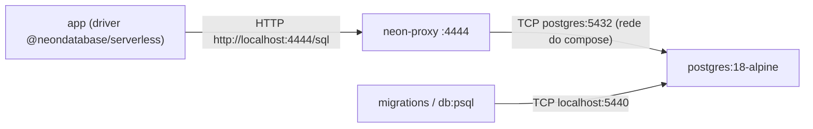

# Operação

> Estado: **Fase 0 — scaffold**. Comandos e bindings abaixo refletem o que
> existe hoje em `package.json` e `wrangler.jsonc` (três ambientes declarados;
> só o dev foi publicado, a produção nasce pelo CI na Fase 0.6). Já existem a stack local de
> banco (Docker, ver "Banco local") e a conexão Drizzle + driver HTTP do Neon,
> exercitada só pela rota `/api/health`. O schema está vazio de propósito e
> ainda não há migrations. R2, auth e IA não estão configurados.

## Visão leiga

Esta página é o manual de "como rodar, testar e publicar" o projeto no estado
atual. Como ainda não há features de produto implementadas, o foco aqui é só a
esteira de desenvolvimento: rodar localmente, gerar o preview no runtime real
da Cloudflare e, futuramente, publicar.

## Comandos (`package.json`)

| Comando | O que faz |
|---|---|
| `npm run dev` | `next dev`. Runtime Node, rápido, com hot reload. **Não é o runtime de produção** — workerd pode se comportar diferente (ver `next.config.ts`, que ativa `initOpenNextCloudflareForDev()` para permitir acesso a bindings mesmo aqui). |
| `npm run build` | `next build` puro (build Next.js, sem empacotar para Cloudflare). |
| `npm run start` | `next start` — serve o build Next.js padrão (Node), não o worker. |
| `npm run preview` | `opennextjs-cloudflare build && opennextjs-cloudflare preview` — builda e sobe o worker localmente via workerd (`http://localhost:8787` por padrão). É o runtime mais próximo de produção disponível localmente. |
| `npm run deploy:dev` | `opennextjs-cloudflare build && opennextjs-cloudflare deploy --env dev` — builda e publica o worker `roseshop-dev`. Deploy manual permitido (ADR-006). |
| `npm run deploy:production` | `node scripts/require-ci.mjs && opennextjs-cloudflare build && opennextjs-cloudflare deploy --env production` — publica o worker `roseshop`. A trava `scripts/require-ci.mjs` só deixa passar se a variável `CI` estiver definida (o GitHub Actions a define); fora do CI imprime erro e sai com código 1 (constitution, princípio VIII). |
| `npm run lint` | `eslint .` — flat config nativa do Next 16 (`eslint.config.mjs`), com `eslint-config-next` para core-web-vitals e TypeScript. |
| `npm run cf-typegen` | `wrangler types --env-interface CloudflareEnv ./cloudflare-env.d.ts` — regenera os tipos TypeScript dos bindings declarados em `wrangler.jsonc`. Rodar sempre após alterar bindings. |
| `npm run typecheck` | `tsc --noEmit` — checagem de tipos de todo o projeto (`tsconfig.json`, modo `strict`). |
| `npm test` | `vitest run` — roda os testes **unitários** (`*.test.ts`, sem banco) uma vez (modo CI). Exclui `*.int.test.ts`. Sem `passWithNoTests`: suíte vazia agora falha. |
| `npm run test:int` | `vitest run --config vitest.int.config.mts` — roda os testes de **integração** (`*.int.test.ts`), que exigem `npm run db:up` e `DATABASE_URL` no `.dev.vars`. Não faz parte do `check` nem do `pre-push`. |
| `npm run test:watch` | `vitest` — modo watch para desenvolvimento. |
| `npm run check` | `npm run lint && npm run typecheck && npm run test` — o gate de "pronto" (lint + tipos + testes), encadeado e interrompido no primeiro erro. |
| `npm run prepare` | `husky` — roda sozinho no `npm install` e aponta `core.hooksPath` para `.husky/_`, ativando os hooks de git. Não precisa ser chamado à mão. |
| `npm run db:up` | `docker compose up -d --wait` — sobe Postgres 18 + proxy Neon e espera o healthcheck do Postgres. |
| `npm run db:down` | `docker compose down` — para os containers; **preserva** os dados (volume `pgdata`). |
| `npm run db:reset` | `docker compose down -v && docker compose up -d --wait` — **DESTRUTIVO: apaga o volume `pgdata` e todos os dados do banco local**, e sobe um banco vazio. Só afeta o local. |
| `npm run db:psql` | `docker compose exec postgres psql -U roseshop -d roseshop` — shell SQL no container (requer `db:up` antes). |

| `npm run db:generate` | `drizzle-kit generate` — gera migration SQL em `src/lib/db/migrations/` a partir de `src/lib/db/schema.ts`. Com o schema vazio, não há o que gerar (o diretório ainda não existe). |
| `npm run db:migrate` | `drizzle-kit migrate` — aplica as migrations no banco de `DATABASE_URL`, por conexão TCP direta (não passa pelo proxy HTTP). |

`drizzle.config.ts` lê `DATABASE_URL` do ambiente e, se ausente, carrega o
`.dev.vars` (`process.loadEnvFile`); sem a variável, falha com erro explícito.
Em CI/dev online/produção a variável vem do ambiente e deve ser a connection
string **direta** do Neon, não a pooled (ADR-002).

## Banco local (Docker)

### Visão leiga

Para desenvolver sem tocar no banco real, o projeto traz um banco de dados de
mentirinha que roda no seu computador, dentro do Docker. Um comando
(`npm run db:up`) liga, outro (`npm run db:down`) desliga. Um segundo
container faz o "tradutor" para o driver HTTP do Neon, o mesmo usado em
produção (ADR-002). Hoje o único uso pelo app é a rota `/api/health`, que
faz um `select 1` para confirmar que o banco responde (ver
[architecture.md, "Camada de banco"](./architecture.md#camada-de-banco-e-health-check)).

### Aprofundamento técnico

Definido em `docker-compose.yml` (projeto `roseshop`):

| Serviço | Imagem | Porta no host | Observações |
|---|---|---|---|
| `postgres` | `postgres:18-alpine` | `127.0.0.1:5440` -> 5432 | Volume nomeado `pgdata` montado em `/var/lib/postgresql` (layout do Postgres 18; não em `/var/lib/postgresql/data`); healthcheck `pg_isready` (3s, até 20 tentativas). |
| `neon-proxy` | `ghcr.io/timowilhelm/local-neon-http-proxy@sha256:cd2ae14e...` | `127.0.0.1:4444` -> 4444 | Proxy HTTP compatível com `@neondatabase/serverless`. Só sobe depois de o Postgres ficar saudável (`depends_on: service_healthy`). Alcança o Postgres pela rede interna (`postgres:5432`). |



Decisões e pegadinhas:

- **Porta 5440 de propósito**: 5432, 5433 e 5434 estão ocupadas por outros
  projetos e por um Postgres do sistema na máquina do mantenedor. Se a sua
  também tiver conflito, o `db:up` falha ao publicar a porta (a porta é fixa
  no compose; não há variável para trocá-la).
- **Portas presas em `127.0.0.1`**: nada é exposto à rede local.
- **Imagem do proxy fixada por digest**: a tag `:main` é mutável, então o
  digest garante a mesma imagem para todos. É uma imagem comunitária, não
  oficial do Neon. Atualizar o digest é decisão consciente.
- **Credenciais não são segredos**: usuário/senha/banco no compose e no
  `.dev.vars.example` são de um banco local, só em loopback, só com dados de
  seed. Por isso podem ser commitados. **Nunca** reutilize essas credenciais
  em dev online ou produção.
- **Versão do Postgres**: a major local (18) acompanha a do projeto Neon
  (commit `a8ae651`; o Neon em si é informação do mantenedor, ver "Recursos
  online"). **Volume antigo**: quem tinha o volume `pgdata` do Postgres 17 deve
  rodar `npm run db:reset` (destrutivo, só local); o 18 não sobe sobre dados da
  17 nem com o ponto de montagem antigo.
- **`localhost` na connection string** (verificado manualmente pelo
  mantenedor): um `POST` em `http://localhost:4444/sql` com o header
  `Neon-Connection-String` apontando para `localhost:5440` retornou
  `{"ok":1}`. Ou seja, o protocolo HTTP do Neon responde via proxy usando
  `localhost`, funcionando offline, sem depender do DNS do `localtest.me`.
  A verificação foi manual; não há teste automatizado no repositório.
- **`global_fetch_strictly_public` não bloqueia o proxy local (resolvido)**:
  a flag em `wrangler.jsonc` era um risco para o `fetch` do worker a
  `localhost:4444`. Validado no workerd: `npm run preview` com `/api/health`
  respondeu 200 `{db: ok}` (corpo do commit `6ed2cfc`).
- Primeira subida baixa as imagens; `db:up` precisa de Docker disponível no WSL.

## Hooks de git (husky)

### Visão leiga

Antes de um commit ou push sair da sua máquina, três "porteiros" automáticos
conferem o trabalho: um procura segredos esquecidos no código, outro barra
mensagens de commit fora do padrão, e o último roda toda a verificação de
qualidade antes de enviar. Eles são instalados sozinhos ao rodar `npm install`
(script `prepare`). Os scripts ficam em `.husky/`.

### Hooks

| Hook | Arquivo | O que faz | Falha quando |
|---|---|---|---|
| `pre-commit` | `.husky/pre-commit` | 1) Exige `gitleaks` no `PATH`; 2) `gitleaks git --pre-commit --staged --redact --no-banner --verbose` nos arquivos em stage; 3) `npx --no -- lint-staged`. | `gitleaks` ausente; gitleaks acha possível segredo; ESLint falha nos arquivos em stage. |
| `commit-msg` | `.husky/commit-msg` | 1) Rejeita mensagem com linha `Co-Authored-By:` ou `Claude-Session:` (início de linha, sem diferenciar maiúsculas) ou texto "generated with ... claude"; 2) `npx --no -- commitlint --edit "$1"`. | Trailer proibido (constitution, princípio VI) ou mensagem fora do Conventional Commits. |
| `pre-push` | `.husky/pre-push` | `npm run check` (lint + typecheck + testes). | Qualquer etapa do `check` falha. |

Configs relacionadas:

| Arquivo | Conteúdo |
|---|---|
| `.lintstagedrc.json` | Para `*.{ts,tsx,js,jsx,mjs,mts,cjs}` roda `eslint --max-warnings=0 --no-warn-ignored` (só nos arquivos em stage; zero warnings tolerados). |
| `commitlint.config.mjs` | Estende `@commitlint/config-conventional`, sem regras customizadas. |

Detalhes que costumam surpreender:

- `gitleaks` é resolvido por `command -v` no `PATH`, **não** por caminho fixo.
  Se `~/.local/bin` não estiver no `PATH` do shell que roda o git, o hook
  falha com "gitleaks não encontrado" mesmo com o binário instalado.
- Não há `.gitleaks.toml`: valem as regras padrão do gitleaks.
- `npx --no` impede baixar pacotes na hora: `lint-staged` e `commitlint`
  precisam estar instalados (`npm install`).
- O `pre-push` roda a suíte inteira e pode demorar; é o mesmo gate de "pronto"
  do `CLAUDE.md`.

### Hooks locais não são o gate definitivo

Qualquer hook pode ser pulado com `--no-verify` (`git commit --no-verify`,
`git push --no-verify`), e quem não rodou `npm install` não os tem ativos. O
gate definitivo será o **CI** (Fase 0.6), ainda **não implementado** (ver
seção "Deploy"). Até lá, os hooks são só a primeira linha de defesa.

### Instalar o gitleaks no WSL

O `pre-commit` exige o binário. Versão usada: **8.30.1**. Instalação com
verificação de checksum (rodar no terminal do WSL):

```bash
VERSION=8.30.1
cd "$(mktemp -d)"
gh release download "v${VERSION}" --repo gitleaks/gitleaks \
  --pattern "gitleaks_${VERSION}_linux_x64.tar.gz" \
  --pattern "gitleaks_${VERSION}_checksums.txt"
sha256sum --check --ignore-missing "gitleaks_${VERSION}_checksums.txt"
tar -xzf "gitleaks_${VERSION}_linux_x64.tar.gz" gitleaks
mkdir -p ~/.local/bin
install -m 755 gitleaks ~/.local/bin/gitleaks
gitleaks version   # deve imprimir 8.30.1
```

Só instale depois de o `sha256sum --check` reportar `OK`. Os nomes dos
assets (`linux_x64` e `checksums.txt`) seguem o padrão de releases do
gitleaks; o bloco acima é uma receita reconstruída, não um script do
repositório — se o `gh release download` não achar o asset, liste com
`gh release view v8.30.1 --repo gitleaks/gitleaks`.

### Auditoria inicial do histórico

Ao adotar os hooks, rodou-se `gitleaks git` sobre o histórico existente:
**nenhum vazamento em 21 commits**. (Informação do mantenedor; não há
relatório versionado no repositório.)

## Testes (Vitest)

Há dois tipos de teste, cada um com sua config:

| Tipo | Arquivos | Config | Como roda | Banco |
|---|---|---|---|---|
| Unitário | `src/**/*.test.{ts,tsx}` | `vitest.config.mts` + `vitest.setup.ts` | `npm test`; entra no `npm run check` e no `pre-push` | Não precisa |
| Integração | `src/**/*.int.test.{ts,tsx}` | `vitest.int.config.mts` + `vitest.int.setup.ts` | `npm run test:int`, manual; **fora** do `pre-push` | Exige `npm run db:up`; o setup falha se `DATABASE_URL` faltar (lê `.dev.vars` se existir), `testTimeout` de 15 s |

Hoje existem `src/lib/db/health.test.ts` (unitário) e
`src/lib/db/client.int.test.ts` (integração, via proxy local). Configuração
do tipo unitário (`vitest.config.mts`):

| Aspecto | Configuração | Observação |
|---|---|---|
| Runner | Vitest `^5.0.3` (instalado: 5.0.3) | Plugin `@vitejs/plugin-react` para JSX/TSX. |
| Ambiente padrão | `node` | Testes de componente devem usar `jsdom` (instalado como devDependency); a convenção é declarar o ambiente no próprio arquivo de teste, pois não há override global. |
| Globals | desligados (sem `globals: true`) | `describe`, `it`, `expect`, `vi` precisam ser importados de `vitest`. |
| Alias `@/*` | resolvido nativamente pelo Vite (`resolve.tsconfigPaths: true`) | Lê os `paths` do `tsconfig.json`; substitui o plugin `vite-tsconfig-paths`, removido do projeto. |
| Arquivos de teste | `src/**/*.test.{ts,tsx}`, exceto `*.int.test.*` | Testes fora de `src/` não são descobertos; os de integração têm config própria. |
| Setup | `vitest.setup.ts` importa `@testing-library/jest-dom/vitest` | Matchers como `toBeInTheDocument` ficam disponíveis. |

Os testes rodam em Node/jsdom, **não em workerd**: não substituem a validação
no `preview` para bindings, R2, auth e IA.

## Dependências com ressalvas

### `esbuild` fixado em `0.28.1` (devDependency)

`@opennextjs/cloudflare` (instalado: 1.20.8) importa `esbuild` sem declará-lo
em suas dependências (*phantom dependency*): sem um `esbuild` na raiz, o build
do OpenNext depende de hoisting acidental. Por isso `esbuild` está fixado
(versão exata, sem `^`) em `devDependencies`. O Vite 8 exige `^0.27 || ^0.28`
na raiz, e `0.28.1` (a mesma do wrangler) atende aos dois. Foi verificado com
build completo do OpenNext + `preview` respondendo 200 (corpo do commit
`ccb808b`).

**Não remova** essa entrada até o OpenNext declarar `esbuild` como dependência
própria. Ao atualizar `@opennextjs/cloudflare`, reavalie.

### `allowScripts` no `package.json`

Campo `allowScripts` lista os pacotes cujo script de instalação (postinstall)
tem aprovação explícita para rodar. Por padrão, scripts de instalação de
dependências são um vetor de ataque de supply chain; aqui só rodam os
aprovados, por versão exata:

| Entrada | Por que precisa de script |
|---|---|
| `esbuild@0.28.1`, `esbuild@0.25.4` e `esbuild@0.25.12` | Valida/instala o binário nativo do esbuild (a 0.25.4 é a cópia aninhada em `@opennextjs/aws`; a 0.25.12 vem do override abaixo, usada pelo `drizzle-kit`). |
| `workerd@1.20261001.1` | Binário do runtime da Cloudflare usado no `preview`. A aprovação é por versão exata e o `workerd` muda a cada atualização do `wrangler`: todo bump do wrangler exige reaprovar com `npm approve-scripts workerd`. |
| `unrs-resolver@1.12.2` | Resolver nativo, dependência transitiva de `eslint-config-next` (via `eslint-import-resolver-typescript`). |

Regra: **pacote novo com script de instalação precisa de aprovação explícita**
(nova entrada em `allowScripts`, decisão do tech-lead). Como as chaves incluem
a versão, um bump de versão desses pacotes também exige atualizar a entrada.
A coluna "por que" acima é inferência pela função de cada pacote; o motivo
da aprovação não está descrito em nenhum arquivo do repositório além do
commit `ccb808b` (que apenas diz "approved explicitly").

### Override `@esbuild-kit/core-utils` -> `esbuild` 0.25.12

`package.json` tem `overrides` forçando `@esbuild-kit/core-utils` (loader do
`drizzle-kit`) a usar `esbuild` 0.25.12 em vez do 0.18.20 que ele traria
(GHSA-67mh-4wv8-2f99, afeta só o dev server do esbuild, sem exposição no uso
do `drizzle-kit`). Verificado no commit `6ed2cfc`: o `drizzle-kit` carrega
`drizzle.config.ts` pelo loader com override. **Não remova** o override sem
reavaliar a vulnerabilidade; a entrada `esbuild@0.25.12` em `allowScripts`
depende dele.

## Auditoria de dependências

Política (decisão do mantenedor; **ainda não aplicada por CI**, que é a
Fase 0.6):

- **Runtime** (`npm audit --omit=dev`): vulnerabilidade `high`/`critical`
  bloqueia o PR no CI. Estado em `6ed2cfc`: 0 vulnerabilidades de runtime.
- **Dev**: vulnerabilidade aceita fica documentada com justificativa e data de
  revisão.

| Advisory | Pacote/caminho | Justificativa | Aceita em | Revisar em |
|---|---|---|---|---|
| GHSA-vfj7-8cjw-p6xm | `braces`, via `eslint-config-next` | Sem versão corrigida; os padrões glob vêm só da nossa config. | 2026-10-03 | 2026-11-03 |

## Bindings

Detalhados em um só lugar: [architecture.md, seção "Build e deploy"](./architecture.md#build-e-deploy-opennext--wrangler).
Para regenerar os tipos após mudar bindings, use `npm run cf-typegen`.

## Variáveis de ambiente

`.dev.vars.example` (commitado; exceção no `.gitignore`) lista as chaves
esperadas. Copie para `.dev.vars` (ignorado pelo git; este documento nunca o
lê). Os valores do exemplo são da stack local e não são segredos (ver "Banco
local").

| Variável | Propósito | Onde é usada | Tipo |
|---|---|---|---|
| `NEXTJS_ENV` | Vem do template do OpenNext. O adaptador a lê no `preview` para escolher qual arquivo `.env.*` do Next carregar (exemplo: `development`). | Adaptador OpenNext, no `preview`; **não** é usada pelo código de `src/`. | Var de configuração local (não sensível) |
| `DATABASE_URL` | Connection string do Postgres. Local: `localhost:5440`. A mesma string serve ao driver (via proxy) e às migrations (conexão direta). | `src/lib/db/client.ts` (`createDb`, via `/api/health`), `drizzle.config.ts` e `vitest.int.setup.ts`. | Secret em dev online e produção (`wrangler secret --env dev` / `--env production`), conforme ADR-006 (segredos de runtime do app ficam somente na Cloudflare); no local, valor não sensível |
| `NEON_FETCH_ENDPOINT` | Endpoint do proxy HTTP local do Neon (`.../sql`). | `src/lib/db/client.ts` (`neonConfig.fetchEndpoint`). Definir **somente no local**; **ausente** em dev online e produção (o driver usa o endpoint padrão do Neon). | Var pública, só local |

| `AUTH_SECRET` | Segredo de assinatura das sessões do Auth.js. **Gerado** (`openssl rand -base64 32`); não vem do Google. **Diferente em cada ambiente** (local, dev, produção). | Nenhum consumidor no código ainda (feature 001, Auth.js). | Secret em dev online e produção |
| `AUTH_GOOGLE_ID` | Client ID do OAuth do Google (termina em `.apps.googleusercontent.com`). | Nenhum consumidor ainda (feature 001). | Secret em dev online e produção |
| `AUTH_GOOGLE_SECRET` | Client Secret do OAuth do Google (começa com `GOCSPX-`). | Nenhum consumidor ainda (feature 001). | Secret em dev online e produção |
| `ADMIN_EMAILS` | Allowlist de e-mails das administradoras, separados por vírgula, sem espaço. | Nenhum consumidor ainda (feature 001). | Secret em dev online e produção (contém e-mails pessoais) |
| `OPENAI_API_KEY` | Chave da OpenAI (começa com `sk-`); local e dev usam a do projeto `roseshop-dev`, produção usará a de `roseshop-prod`. | Nenhum consumidor ainda (feature 005, IA). | Secret em dev online e produção |

As cinco últimas estão declaradas em `.dev.vars.example` e tipadas em
`cloudflare-env.d.ts` (confirmado), mas **nenhum arquivo de `src/` as
referencia ainda** (confirmado por grep). Chaves de R2 não são variáveis: R2
é binding (ver "Bindings").

### Google OAuth (informação do mantenedor)

Não verificável nos arquivos do repositório. Projeto `roseshop` no Google
Cloud, app em modo **Testing** com as administradoras como test users, e um
**único client Web** com 4 redirect URIs (sempre `/api/auth/callback/google`):
`localhost:3000`, `localhost:8787`, `roseshop-dev` e `roseshop`.

### OpenAI (informação do mantenedor)

Não verificável nos arquivos. Projetos `roseshop-dev` e `roseshop-prod`;
créditos pré-pagos com **auto-recharge desligado** (o saldo é o teto rígido) e
limite de uso configurado nos projetos. Há uma lista curta de modelos baratos
com entrada de imagem, a reduzir para um na feature 005. A chave de produção
**ainda não foi criada**.

## Deploy

### Visão leiga

O projeto tem três "cópias": a **local** (no seu computador), a **dev**
(publicada na internet para testar) e a **produção** (a loja de verdade). Cada
uma tem seu próprio nome de worker e seu próprio bucket de imagens, de modo que
mexer em uma não afeta as outras. Dev pode ser publicado à mão; produção só
pelo CI.

### Aprofundamento técnico

`wrangler.jsonc` (ver [architecture.md, "Build e deploy"](./architecture.md#build-e-deploy-opennext--wrangler)
para os bindings):

| Ambiente | Como selecionar | Worker | R2 (`PRODUCT_IMAGES`) | Deploy |
|---|---|---|---|---|
| Local | nível de cima (sem `--env`); `npm run preview` | `roseshop-local` | `roseshop-local` (simulado em `.wrangler/state/`) | não há |
| Dev | `--env dev` | `roseshop-dev` | `roseshop-dev` | `npm run deploy:dev` (manual) |
| Produção | `--env production` | `roseshop` | `roseshop-prod` | `npm run deploy:production` (só CI) |

Regras:

- O nível de cima tem nome inofensivo (`roseshop-local`): um `wrangler deploy`
  sem `--env` nunca atinge dev nem produção. **Nunca** use `"remote": true`
  no nível de cima.
- O nome do binding é o mesmo nos três (`PRODUCT_IMAGES`, `IMAGES`,
  `WORKER_SELF_REFERENCE`); só o recurso muda. `r2_buckets`, `images` e
  `services` são **redeclarados por env** (não herdados); `ASSETS` (`assets`) é
  herdado.
- Os scripts `deploy` e `upload` antigos foram removidos (commit `fffa3fe`).
- Validado no commit `fffa3fe`: dry-run dos bindings por ambiente e
  `/api/health` 200 no preview local. O mantenedor também validou no dev
  publicado: `/api/health` 503 sem o secret e 200 com ele.

### Recursos online (informação do mantenedor)

Não verificável nos arquivos do repositório; vem do relato do mantenedor e dos
corpos de commit.

| Recurso | Estado |
|---|---|
| R2 `roseshop-dev` e `roseshop-prod` | Criados, localização **ENAM**. O R2 não tem região na América do Sul. (Os nomes dos buckets conferem com `wrangler.jsonc`.) |
| Neon | Projeto `roseshop`, Postgres 18, região São Paulo; branches `production` (padrão) e `dev` (sem expiração). |
| Subdomínio `workers.dev` da conta | `willsmt`, **compartilhado por todos os workers da conta**: trocá-lo quebra todas as URLs. Dev em `https://roseshop-dev.willsmt.workers.dev`. |
| Worker `roseshop` (produção) | **Ainda não existe**: nasce pelo CI na Fase 0.6; o secret de produção é cadastrado logo após o primeiro deploy. |
| Custos | Budget alert de US$ 1 na conta Cloudflare (informativo, não pausa o uso). A conta também hospeda o bucket `comunidade-belleetbelle`: a cota gratuita do R2 é **compartilhada**. |

### Cadastrar um secret

```bash
npx wrangler secret put DATABASE_URL --env dev        # ou --env production
```

Para `DATABASE_URL`, cole o valor **somente no prompt** interativo (nunca em
argumento, arquivo ou histórico do shell). Para os demais secrets, prefira o
procedimento por pipe abaixo. Dev online tem 6 secrets cadastrados
(informação do mantenedor): `DATABASE_URL`, `AUTH_SECRET`, `AUTH_GOOGLE_ID`,
`AUTH_GOOGLE_SECRET`, `ADMIN_EMAILS`, `OPENAI_API_KEY`. Em produção, cadastre
logo após o primeiro deploy; até lá `/api/health` responde 503.

#### Procedimento por pipe (validar e enviar)

Verificado na prática (informação do mantenedor). Colar no prompt causou
valores trocados entre secrets e um espaço inicial no Client ID. Então:

1. Valide o valor **no `.dev.vars` local pelo formato**, sem imprimi-lo:
   Client ID termina em `.apps.googleusercontent.com`; Client Secret começa
   com `GOCSPX-`; chave da OpenAI começa com `sk-`; nenhum valor com espaço
   no início.
2. Envie ao ambiente por pipe, extraindo a chave exata do arquivo:

```bash
grep '^AUTH_GOOGLE_ID=' .dev.vars | cut -d= -f2- | tr -d '\n' \
  | npx wrangler secret put AUTH_GOOGLE_ID --env dev
```

Exceção: `AUTH_SECRET` **não** se copia do `.dev.vars`; gere um novo por
ambiente (`openssl rand -base64 32`). Não use `echo` com o valor.

**Pendência (Fase 0.6)**: após o primeiro deploy de produção pelo CI, criar a
chave OpenAI de produção e cadastrar os secrets de produção pelo mesmo
procedimento (validar + pipe).

**Regra operacional**: ao rodar wrangler, responda **no** a qualquer oferta de
alterar o `wrangler.jsonc` ("add it on your behalf"); o arquivo é de
autoria do tech-lead.

### CI

Não existe pipeline de CI (GitHub Actions) neste repositório. O fluxo do
ADR-006 (lint/typecheck/teste → migration → deploy dev por PR; merge em `main`
→ migration → deploy produção) segue sem implementação; só a trava
`scripts/require-ci.mjs` já o antecipa. Ver alerta em
[architecture.md](./architecture.md#divergência-com-adr-006-alerta-ao-tech-lead).

## Troubleshooting

- **Qual porta/runtime estou validando?** `npm run dev` sobe em
  `http://localhost:3000` (porta padrão do Next, sem override no repo) e roda em
  **Node**. `npm run preview` sobe em `http://localhost:8787` e roda em
  **workerd**. Só o `preview` vale como validação de runtime e de build
  (bindings, R2, auth, IA): `dev` e testes Vitest (Node/jsdom) não detectam
  incompatibilidades do workerd.
- **`next dev` funcionando mas `preview` quebrando**: esperado às vezes —
  `next dev` roda em Node, `preview` roda em workerd (runtime real da
  Cloudflare). Qualquer API Node-only ou binding ausente só aparece no
  `preview`. Valide sempre no `preview` antes de considerar algo pronto.
- **Bindings não aparecem nos tipos (`cloudflare-env.d.ts`)**: rodar
  `npm run cf-typegen` depois de qualquer mudança em `wrangler.jsonc`.
- **Secret com valor trocado ou com espaço inicial** (login Google falha,
  `invalid_client`, 401 da OpenAI): causado por colagem manual no prompt do
  `wrangler secret put`. Revalide o formato no `.dev.vars` e reenvie por pipe
  (ver "Cadastrar um secret"). `wrangler secret list` mostra só nomes, não
  confere valores.
- **`.dev.vars` ausente ou incompleto**: compare as chaves com
  `.dev.vars.example` (tabela em "Variáveis de ambiente"). O `/api/health` é o
  único consumidor: sem `DATABASE_URL` ele responde 503 `{db: "error"}` (não lança).
- **`npm run db:up` falha com "port is already allocated"**: algo no host usa
  5440 ou 4444. Libere a porta; o compose não a parametriza.
- **`db:up` falha por Docker indisponível**: confirme que o Docker responde no
  WSL (`docker ps`).
- **Perdi os dados do banco local**: `npm run db:reset` apaga o volume
  `pgdata`. É o comportamento esperado; só afeta o local.
- **`/api/health` devolve 503 `{db: "error"}`**: banco inacessível, `DATABASE_URL`
  errada **ou ausente** (secret não cadastrado no ambiente; o log diz
  `[health] configuração do banco ausente ou inválida`). O log traz só o tipo do erro (`[health] falha ao
  consultar o banco (<tipo>)`), de propósito; confira `docker compose ps` e o
  `.dev.vars`.
- **`npm run test:int` falha com "DATABASE_URL ausente"**: rode `npm run db:up`
  e configure o `.dev.vars` a partir do `.dev.vars.example`.
- **`psql`/migration não conecta**: use `localhost:5440` (não 5432) e confirme
  que o Postgres está saudável (`docker compose ps`).
- **Commit bloqueado com "gitleaks não encontrado"**: instale conforme a seção
  "Instalar o gitleaks no WSL" e confirme que `~/.local/bin` está no `PATH`.
- **Commit bloqueado por possível segredo**: o gitleaks imprime o achado com
  o valor ocultado (`--redact`). Remova o segredo do stage; se já foi
  commitado antes, trate como incidente e avise o tech-lead. Não use
  `--no-verify` para contornar.
- **Commit rejeitado pelo `commit-msg`**: remova trailers `Co-Authored-By` /
  `Claude-Session` e use Conventional Commits (`tipo(escopo): resumo`).
- **Push demorado ou bloqueado**: o `pre-push` roda `npm run check`; rode-o
  antes e corrija o que falhar.
- **Desenvolvimento somente no WSL**: o OpenNext não é suportado oficialmente
  em Windows nativo (`.specify/memory/constitution.md`, princípio VII; `CLAUDE.md`, seção
  "Ambiente"). Rode `dev`, `preview`, `build` e `deploy:*` sempre no terminal do
  WSL, nunca no PowerShell/CMD.
- **Erro "dubious ownership" ao rodar `git` pelo PowerShell via
  `\\wsl.localhost\...`**: o repositório pertence ao usuário do WSL e o Git do
  Windows o vê como de outro dono. Solução: usar o terminal do WSL para o
  git, em vez de adicionar o caminho em `safe.directory`. (Orientação do
  mantenedor; não está registrada em nenhum arquivo do repositório.)
- **`next lint` não existe no Next 16**: o comando foi removido, por isso o
  script é `"lint": "eslint ."` em `package.json`, com `eslint.config.mjs`
  (flat config). Confirmado: a CLI instalada (`next@16.3.8`) não traz
  `next-lint`. Não "restaure" o script para `next lint`.
