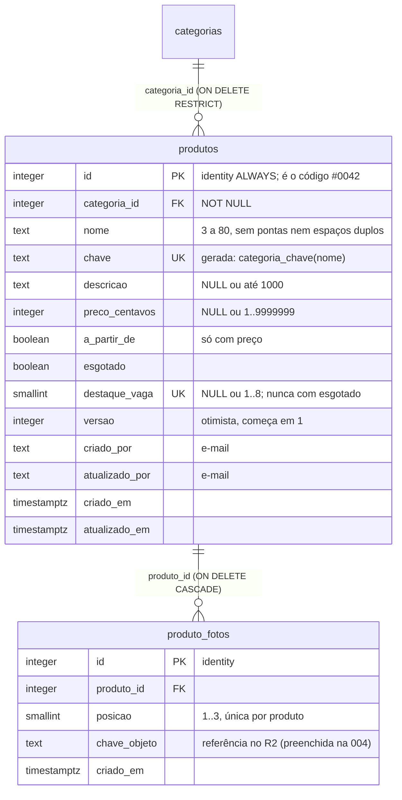

# Data model — Feature 003 (produtos)

**Data**: 2026-10-07 | Decisões: [research.md](./research.md) (D1–D10 tomadas)

## Diagrama



## Tabela `produtos`

| Coluna | Tipo | Regras | Requisito |
|---|---|---|---|
| `id` | `integer` | PK, `GENERATED ALWAYS AS IDENTITY`. É também o código de referência, exibido como `#` + `lpad(id, 4, '0')` (D2). Identity `ALWAYS` recusa `UPDATE` (imutável) e nunca reaproveita valores | FR-010, FR-011 |
| `categoria_id` | `integer` | `NOT NULL REFERENCES categorias(id) ON DELETE RESTRICT` — **`RESTRICT` explícito obrigatório** (só `23001` vira `tem_produtos`). Índice `produtos_categoria_id_idx` | FR-007, FR-029, contrato §5 da 002 |
| `nome` | `text` | `NOT NULL`. Checks: `produtos_nome_tamanho` (`char_length BETWEEN 3 AND 80`), `produtos_nome_sem_pontas` (`= btrim`), `produtos_nome_sem_espacos_duplos` (`!~ '\s{2,}'`) | FR-003 |
| `chave` | `text` | `GENERATED ALWAYS AS (categoria_chave(nome)) STORED`, `NOT NULL`, constraint `produtos_chave_unique`. Nenhum código a grava (D4) | FR-004 |
| `descricao` | `text` | `NULL` ou `char_length <= 1000` (`produtos_descricao_tamanho`) | FR-003 |
| `preco_centavos` | `integer` | `NULL` ou `BETWEEN 1 AND 9999999` (`produtos_preco_faixa`) | FR-006, constitution IV |
| `a_partir_de` | `boolean` | `NOT NULL DEFAULT false`; `produtos_a_partir_de_com_preco`: `NOT a_partir_de OR preco_centavos IS NOT NULL` | FR-006 |
| `esgotado` | `boolean` | `NOT NULL DEFAULT false` (D6) | FR-008, FR-015 |
| `destaque_vaga` | `smallint` | `NULL` = fora do destaque. `produtos_destaque_vaga_faixa`: `BETWEEN 1 AND 8`; índice único parcial `produtos_destaque_vaga_unique ON (destaque_vaga) WHERE destaque_vaga IS NOT NULL`; `produtos_destaque_disponivel`: `NOT (esgotado AND destaque_vaga IS NOT NULL)` (D1) | FR-018 |
| `versao` | `integer` | `NOT NULL DEFAULT 1`; incrementada em toda alteração de FR-026 | FR-026 |
| `criado_por` | `text` | `NOT NULL`, e-mail da sessão no cadastro | FR-027 |
| `atualizado_por` | `text` | `NOT NULL`; igual a `criado_por` no cadastro, depois o e-mail da última alteração | FR-027 |
| `criado_em` / `atualizado_em` | `timestamptz` | `NOT NULL DEFAULT now()`; `atualizado_em` gravado pela query (sem trigger, como na 002) | constitution IV |

Índices: PK (`id`, atende `ORDER BY id DESC` da lista, D3), `produtos_chave_unique`,
`produtos_categoria_id_idx`, `produtos_destaque_vaga_unique` (parcial).

## Tabela `produto_fotos` (só modelo nesta feature)

| Coluna | Tipo | Regras |
|---|---|---|
| `id` | `integer` | PK, identity |
| `produto_id` | `integer` | `NOT NULL REFERENCES produtos(id) ON DELETE CASCADE` (D7) |
| `posicao` | `smallint` | `NOT NULL CHECK BETWEEN 1 AND 3`; `UNIQUE (produto_id, posicao)` ⇒ no máximo 3 fotos por produto, por construção |
| `chave_objeto` | `text` | `NOT NULL` (caminho do objeto no R2; formato definido na 004) |
| `criado_em` | `timestamptz` | `NOT NULL DEFAULT now()` |

Na 003 nenhum código escreve aqui (sem action, sem tela). A limpeza dos objetos do R2
na remoção do produto é da 004. FR-014 (≥ 1 foto) não é constraint nesta feature.

## Invariantes e onde cada um é garantido

| Invariante | Garantia | Atômico? |
|---|---|---|
| Nome único por equivalência | `UNIQUE(chave)` | Banco |
| Código único, imutável, não reaproveitado | identity `ALWAYS` | Banco |
| Produto nunca aponta para categoria inexistente | FK (`FOR KEY SHARE` + `RESTRICT`) | Banco |
| Categoria com produtos não é removida | FK `ON DELETE RESTRICT` ⇒ `23001` | Banco |
| "A partir de" só com preço; preço na faixa; tamanhos | `CHECK` | Banco (+ Zod para a mensagem) |
| Esgotado nunca em destaque | `CHECK produtos_destaque_disponivel` | Banco |
| Esgotar tira do destaque | um `UPDATE` só | Statement único |
| No máximo 8 destaques | `CHECK 1..8` + índice único parcial de `destaque_vaga` | Banco |
| Concorrência otimista | `WHERE id AND versao` em todo `UPDATE`/`DELETE` | Statement único |
| Todo writer de `produtos` incrementa `versao` | Convenção de código (sem constraint). Sustenta o `saiuDoDestaque` do `esgotar` (CTE `antes`) e a precedência da leitura após 0 linhas; escrita futura sem `versao + 1` quebra as duas | Convenção |
| No máximo 3 fotos, posições únicas | `CHECK` + `UNIQUE (produto_id, posicao)` | Banco |

## Transições de estado

```text
              cadastrar
                 │
                 ▼
   ┌──── Disponível, sem vaga ◄─────────── tirar do destaque ────┐
   │             │   ▲                                           │
   │  esgotar    │   │ disponibilizar          destacar          │
   │             ▼   │                  (menor vaga livre 1..8)  │
   │        Esgotado, sem vaga                                   │
   │             ▲                                               │
   │             └── esgotar (vaga = NULL na mesma ação) ─── Disponível, com vaga
   │
   └── remover (qualquer estado, otimista) ──► apagado de vez (id nunca volta)
```

- Disponibilizar nunca recoloca no destaque (FR-017).
- Destacar sem vaga livre ⇒ `limite`; duas pessoas pegando a mesma vaga ⇒ uma recebe
  `vaga_disputada` ("tente de novo"), sem alterar nada.
- Destacar produto já em destaque (versão correta) ⇒ `ja_em_destaque`, sem alterar nada.
  Precedência da leitura após 0 linhas: inexistente → versão diferente → esgotado → já em
  destaque → limite (contrato §2).
- Toda seta (exceto cadastrar) exige a `versao` lida e incrementa `versao`,
  `atualizado_por` e `atualizado_em`; remover não grava autoria.

## Mudanças em código existente (feature 002)

- `contarProdutosDaCategoria` (`src/lib/db/categorias.ts`): SQL cru → `db.select({ n:
  count() }).from(produtos).where(eq(produtos.categoriaId, id))` (mesmo comportamento: um
  único `count(*)`). Assinatura inalterada.
- `src/test/db/categorias-fixtures.ts`: remover `criarFixtureProdutos`,
  `descartarFixtureProdutos` e o estado `produtosCriadaPeloHelper`; o teste
  `categorias.produtos-fixture.int.test.ts` passa a inserir produtos reais (renomeado
  para refletir isso) e `resetCategorias` limpa `produtos` antes de `categorias` (a FK
  impediria o reset).
- Barrel `src/lib/categorias/index.ts` passa a exportar `normalizarNome` (D5), com a
  allowlist da conformidade e o §1 do contrato da 002 atualizados.

## Migration `0001`

Gerada por `drizzle-kit generate` a partir do `schema.ts`. Não deve exigir edição
manual: `categoria_chave` já existe (migration `0000`) e checks, FK, índice único
parcial (`uniqueIndex().on(...).where(...)`) e índices são expressáveis no Drizzle.
Declarar `onDelete: "restrict"` (o default do Drizzle é `no action`) e conferir no SQL
gerado o `ON DELETE restrict` literal e o `WHERE` do índice parcial. Conferir "No
schema changes" numa segunda geração. Sem seed de produtos.
