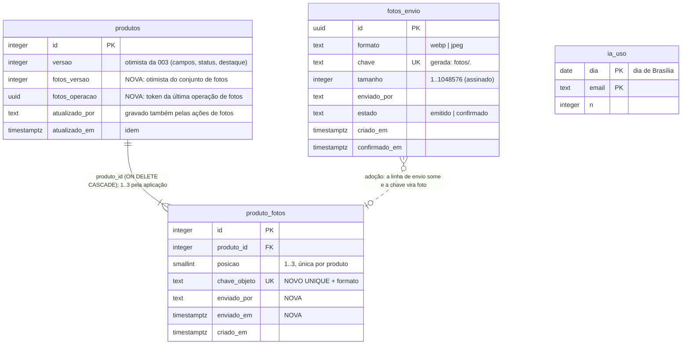

# Data model — Feature 004 (fotos de produto)

**Data**: 2026-10-08 | Decisões: [research.md](./research.md) (D1–D18) | Zona protegida:
schema e migration só pelo tech-lead, com revisão humana.

## Diagrama



## Tabela `fotos_envio` (nova)

Um envio emitido para a área temporária. Some ao ser adotado (vira `produto_fotos`), recusado
na confirmação ou limpo depois de 24 h.

| Coluna | Tipo | Regras | Requisito |
|---|---|---|---|
| `id` | `uuid` | PK; gerado no servidor (`crypto.randomUUID()`) na emissão; `CHECK (uuid_extract_version(id) = 4)` (`fotos_envio_id_v4`), para casar com a regex da chave | FR-015 |
| `formato` | `text` | `NOT NULL`, `CHECK (formato IN ('webp','jpeg'))` (`fotos_envio_formato`) — o declarado na emissão, assinado no `content-type` | FR-011, FR-013 |
| `chave` | `text` | `GENERATED ALWAYS AS ('fotos/' \|\| id::text \|\| CASE formato WHEN 'webp' THEN '.webp' ELSE '.jpg' END) STORED`, `UNIQUE` (`fotos_envio_chave_unique`). Nenhum writer a informa | D2 |
| `tamanho` | `integer` | `NOT NULL`, `CHECK BETWEEN 1 AND 1048576` (`fotos_envio_tamanho`) — o assinado no `content-length` | FR-014 |
| `enviado_por` | `text` | `NOT NULL`, e-mail da sessão | FR-008, FR-009 |
| `estado` | `text` | `NOT NULL DEFAULT 'emitido'`, `CHECK (estado IN ('emitido','confirmado'))` | FR-015 |
| `criado_em` | `timestamptz` | `NOT NULL DEFAULT now()`; base das 24 h | FR-009, FR-037 |
| `confirmado_em` | `timestamptz` | `NULL`; `CHECK ((estado = 'confirmado') = (confirmado_em IS NOT NULL))` (`fotos_envio_confirmacao`) | FR-015 |
| `etag` | `text` | **só se o R1 provar que o R2 não impõe `if-none-match`** (reserva (b) do research D2): `NULL`, gravado na confirmação. Se for necessária, `produto_fotos` ganha a mesma coluna, copiada na adoção. Decidido na SF0, antes da migration | FR-015 |

Sem índice extra: a tabela tem no máximo dezenas de linhas (D13 limita 20 pendentes por pessoa).

## Tabela `produtos` (alterada)

| Coluna nova | Tipo | Regras | Requisito |
|---|---|---|---|
| `fotos_versao` | `integer` | `NOT NULL DEFAULT 1`; incrementada por toda operação de fotos; **nunca** por writer de campos/status/destaque | FR-023, FR-024 |
| `fotos_operacao` | `uuid` | `NULL`; recebe um uuid novo a cada operação de fotos; os statements seguintes do mesmo batch só agem se ela for o token da chamada (D5) | FR-003 |

`versao` (003) **não** muda nas ações de fotos (FR-026); `atualizado_por`/`atualizado_em` mudam.

**Emenda de convenção da 003** (data-model da 003, invariante "Todo writer de `produtos`
incrementa `versao`"): passa a valer para os writers de **campos, status e destaque**. O writer
de fotos altera só `fotos_versao`, `fotos_operacao`, `atualizado_por`, `atualizado_em`.
Justificativa em research D5.

## Tabela `produto_fotos` (alterada; passa a ter writers)

| Coluna | Tipo | Regras | Requisito |
|---|---|---|---|
| `chave_objeto` | `text` | existente `NOT NULL`; **novo** `UNIQUE` (`produto_fotos_chave_unique`) e `CHECK (chave_objeto ~ '^fotos/[0-9a-f]{8}-[0-9a-f]{4}-4[0-9a-f]{3}-[89ab][0-9a-f]{3}-[0-9a-f]{12}\.(webp\|jpg)$')` (`produto_fotos_chave_formato`) | FR-016, D12 |
| `enviado_por` | `text` | **nova**, `NOT NULL` — de `fotos_envio.enviado_por` | Key Entities |
| `enviado_em` | `timestamptz` | **nova**, `NOT NULL` — de `fotos_envio.criado_em` | Key Entities |
| `criado_em` | `timestamptz` | existente; momento em que a linha foi (re)inserida | — |

As duas constraints novas acima foram **aprovadas pelo humano** (research D16): a regra
"no banco continuam só as constraints já existentes" do FR-003 trata de 1 a 3 sem buracos, e
estas protegem outros invariantes. Registrado nas Clarifications da spec e no ADR-009.

As colunas novas são `NOT NULL` sem default: a tabela está vazia em todos os ambientes (nenhum
writer na 003). A migration falha se houver linha, o que é o comportamento desejado.

## Tabela `ia_uso` (nova)

| Coluna | Tipo | Regras |
|---|---|---|
| `dia` | `date` | dia **de Brasília**: `(now() AT TIME ZONE 'America/Sao_Paulo')::date` (data de calendário, não timestamp; a regra "UTC no banco" vale para `timestamptz`) |
| `email` | `text` | e-mail da sessão |
| `n` | `integer` | `NOT NULL`, `CHECK (n >= 1)` |
| PK | | `(dia, email)` |

Linhas de dias antigos não são apagadas (≤ 3 por dia; volume desprezível).

## Registro de locks (`src/lib/db/locks.ts`)

| Chave | Nome | Uso |
|---|---|---|
| `4_001` | `LOCK_FOTOS` | toda escrita em `produto_fotos`, todo consumo de `fotos_envio` (cadastro, ações de fotos), remoção de produto, limpeza |
| `4_002` | `LOCK_IA_USO` | consumo do limite de sugestões |

## Invariantes e onde cada um é garantido

| Invariante | Garantia | Onde |
|---|---|---|
| No máximo 3 fotos, posições 1..3 únicas | `CHECK` + `UNIQUE (produto_id, posicao)` (003) | Banco |
| Pelo menos 1 foto; posições sem buraco | lista nova validada (1..3 itens, posição = ordinal) + batch com lock 4_001 e token | Aplicação (FR-003), teste SC-007 |
| Produto nasce com fotos | `INSERT produtos` condicionado a `count(envios válidos) = N` e fotos inseridas no mesmo batch | Aplicação (batch atômico) |
| Envio adotado no máximo uma vez, só pela dona, confirmado, < 24 h | a adoção **apaga** a linha de `fotos_envio` com essas condições, sob o lock 4_001 | Aplicação + lock |
| Uma chave pertence a no máximo um produto | `UNIQUE (chave_objeto)` | Banco |
| Concorrência das fotos independente da 003 | `fotos_versao` no `WHERE`; writers de fotos não tocam `versao` | Statement único sob lock |
| Destaque sempre com foto | consequência das duas primeiras linhas (FR-004) | Teste SC-005 da 003 estendido |
| Limite de sugestões exato | batch com lock 4_002 | Aplicação + lock |
| Limpeza nunca apaga foto de produto existente nem envio < 24 h | limpeza sob o lock 4_001; objeto só é apagado se ausente das duas tabelas e mais velho que 25 h | Aplicação + lock (contracts/fotos.md §6) |

## Transições de `fotos_envio`

```text
 pedirEnvio ──► emitido ──confirmarEnvio ok──► confirmado ──adoção (cadastro/adicionar/trocar)──► [linha apagada; vira produto_fotos]
                   │                               │
                   │ confirmarEnvio recusa          │ 24 h sem adoção
                   ▼                               ▼
         [linha e objeto apagados]        [limpeza: linha e objeto apagados]
                   ▲
                   └── 24 h sem confirmação (limpeza)
```

`confirmarEnvio` sobre `confirmado` devolve o mesmo resultado sem refazer a verificação
(idempotente, D13).

## Mudanças em código existente (feature 003)

- `inserir` (`src/lib/db/produtos.ts`) é substituído por `inserirComFotos` (contrato §2): única
  porta de criação de produto; a conformidade nega qualquer outro `insert(produtos)`.
- `remover` vira batch com lock 4_001 e devolve as chaves das fotos (D14).
- `listar` devolve `capa` (chave da posição 1); `obterPorId` devolve `fotos` e `fotosVersao`.
- Comentário de `src/lib/db/produtos.ts:177-179` e invariante do data-model da 003 recebem a
  emenda de convenção (D5).
- `src/test/db/produtos-fixtures.ts`: fixtures passam a criar produtos com 1 foto (linha em
  `produto_fotos` com chave sintética **que case com a regex v4**), para manter o invariante nos
  testes da 003.

## Migration `0002`

Gerada por `drizzle-kit generate` a partir do `schema.ts` (coluna gerada com
`generatedAlwaysAs`, checks e uniques expressáveis no Drizzle). No `schema.ts`, o
`generatedAlwaysAs` usa **nomes de coluna crus** no `sql` (sem `${t.formato}`, que o Drizzle
pode qualificar com a tabela) e mantém o `id::text` (é ele que faz o `||` resolver para
`textcat`, IMMUTABLE; sem o cast vira `anytextcat`, STABLE, e o Postgres recusa a coluna
gerada). A coluna precisa ser `STORED` (coluna virtual, padrão no PG 18, não aceita `UNIQUE`).
Na regex do `CHECK`, `\\.` no template. Conferir no SQL: a expressão da
`chave` gerada, o `CHECK` da regex do `chave_objeto` e os nomes das constraints. Conferir "No
schema changes" numa segunda geração. Sem seed. Ordem de aplicação nos ambientes no
quickstart §2 (depois da limpeza dos produtos sem foto).
